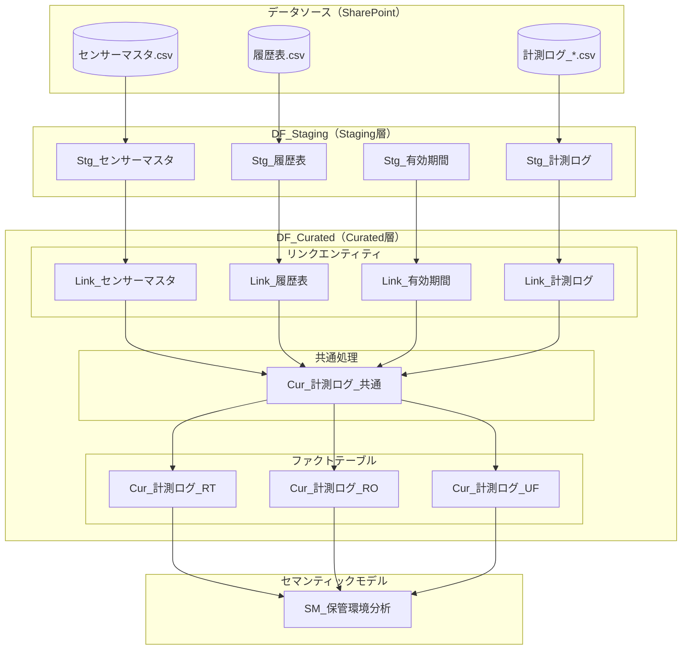
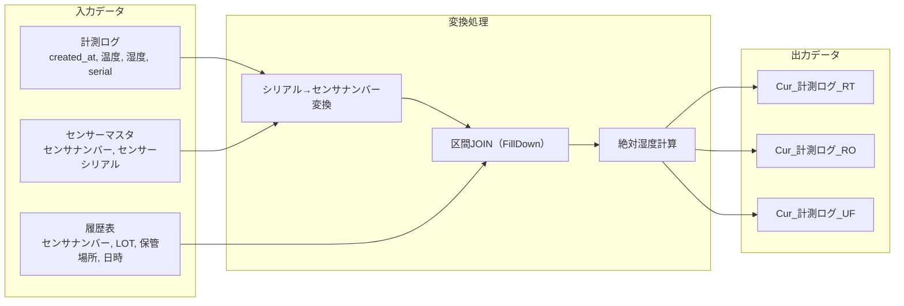
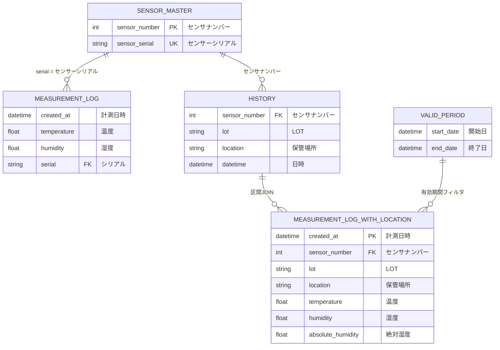

# 全体概要

> **ドキュメントバージョン**: 1.0
> **最終更新日**: 2025-12-11
> **対象プロジェクト**: WIP-Storage-Environment-Analysis

---

## 目次

1. [プロジェクトの目的](#1-プロジェクトの目的)
2. [スコープ](#2-スコープ)
3. [前提条件](#3-前提条件)
4. [成果物一覧](#4-成果物一覧)
5. [全体データフロー構成図](#5-全体データフロー構成図)
6. [関連ドキュメント](#6-関連ドキュメント)

---

## 1. プロジェクトの目的

本プロジェクトは、**保管場所（エリア）と時間帯に応じた保管環境の実態把握**を行い、保管品の性能影響を分析することを目的としています。

### 具体的な目標

- センサーから取得した温湿度データと、保管場所の移動履歴を突合する
- 工程区分別（RT: 常温 / RO: 逆浸透 / UF: 限外ろ過）のファクトテーブルを構築する
- 絶対湿度を計算し、保管環境の詳細な分析を可能にする
- Power BI セマンティックモデルとして提供し、ビジネスユーザーが自由に分析できるようにする

### ビジネス価値

| 価値 | 説明 |
|------|------|
| 品質管理の強化 | 保管環境と製品品質の相関分析が可能 |
| リアルタイム監視 | 環境異常の早期検知 |
| コンプライアンス対応 | 保管環境の履歴追跡と監査対応 |

---

## 2. スコープ

### 対象範囲（In Scope）

| 項目 | 内容 |
|------|------|
| データソース | SharePoint上のCSVファイル（センサーマスタ、履歴表、計測ログ） |
| データフロー | Staging層、Curated層の2層構成 |
| 出力先 | Power BI セマンティックモデル |
| 工程区分 | RT（常温）、RO（逆浸透）、UF（限外ろ過） |

### 対象外（Out of Scope）

- IoTセンサーからの直接データ取得
- アラート通知機能
- 外部システムへのデータエクスポート

---

## 3. 前提条件

### 技術要件

| 項目 | 要件 |
|------|------|
| Power BI ライセンス | Premium Per User（PPU）またはPremium容量 |
| SharePointアクセス | データソースフォルダへの読み取り権限 |
| ブラウザ | Microsoft Edge または Chrome（最新版） |

### データ要件

| 項目 | 要件 |
|------|------|
| センサーマスタ | センサナンバーとシリアルの対応表が最新であること |
| 履歴表 | 時刻データがJST形式であること |
| 計測ログ | ISO 8601形式（+09:00）の時刻データを含むこと |

### 運用要件

- データフローの更新スケジュールを設定すること
- 有効期間マスタのメンテナンス体制を確立すること

---

## 4. 成果物一覧

### データフロー

| 成果物 | 説明 | 更新頻度 |
|--------|------|----------|
| DF_Staging | Staging層データフロー | 日次 |
| DF_Curated | Curated層データフロー | 日次 |

### Staging層エンティティ

| エンティティ | 説明 |
|--------------|------|
| Stg_センサーマスタ | センサー基本情報（正規化済み） |
| Stg_履歴表 | 保管場所移動履歴（型変換済み） |
| Stg_計測ログ | 温湿度計測データ（統合・正規化済み） |
| Stg_有効期間 | データ有効期間定義 |

### Curated層エンティティ

| エンティティ | 説明 |
|--------------|------|
| Link_センサーマスタ | Staging層からの参照 |
| Link_履歴表 | Staging層からの参照 |
| Link_有効期間 | Staging層からの参照 |
| Link_計測ログ | Staging層からの参照 |
| Cur_計測ログ_共通 | 共通処理適用後の計測ログ |
| Cur_計測ログ_RT | 常温工程用ファクトテーブル |
| Cur_計測ログ_RO | 逆浸透工程用ファクトテーブル |
| Cur_計測ログ_UF | 限外ろ過工程用ファクトテーブル |

### セマンティックモデル

| モデル | 説明 |
|--------|------|
| SM_保管環境分析 | 分析用セマンティックモデル |

---

## 5. 全体データフロー構成図

### システム全体構成

### データ処理フロー詳細

### エンティティ関係図

---

## 6. 関連ドキュメント

| ドキュメント | 説明 | リンク |
|--------------|------|--------|
| 環境構築手順 | Power BI環境の構築手順 | [01_environment_setup.md](./01_environment_setup.md) |
| Staging層実装手順 | DF_Stagingの実装詳細 | [02_staging_layer.md](./02_staging_layer.md) |
| Curated層実装手順 | DF_Curatedの実装詳細 | [03_curated_layer.md](./03_curated_layer.md) |
| 区間JOIN処理詳細 | FillDownによる区間JOIN | [04_interval_join_logic.md](./04_interval_join_logic.md) |
| テスト手順 | 単体・結合テスト | [05_testing_procedure.md](./05_testing_procedure.md) |
| トラブルシューティング | 問題対処法 | [06_troubleshooting.md](./06_troubleshooting.md) |
| 用語集・リファレンス | 用語定義と参照情報 | [07_reference.md](./07_reference.md) |

---

**次のステップ**: [環境構築手順](./01_environment_setup.md) に進んでください。
