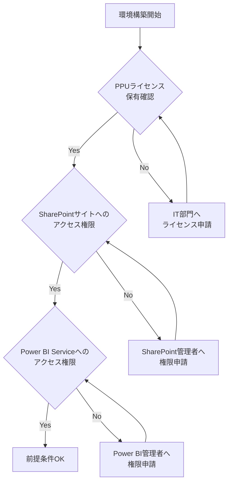
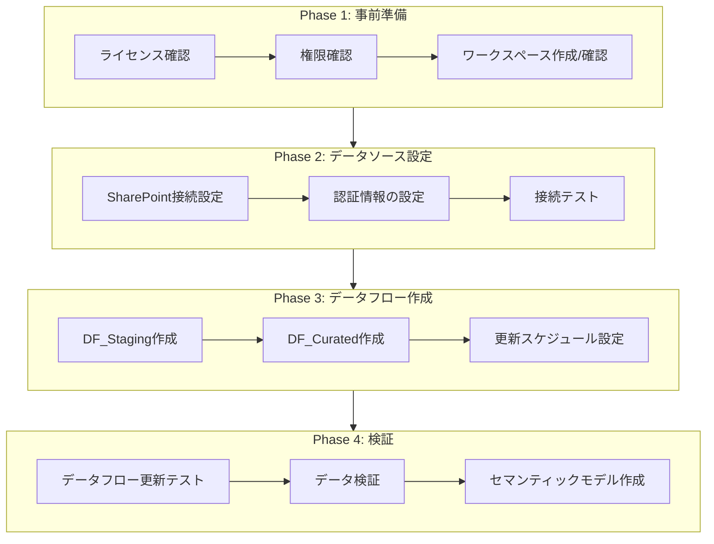
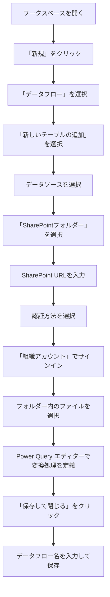
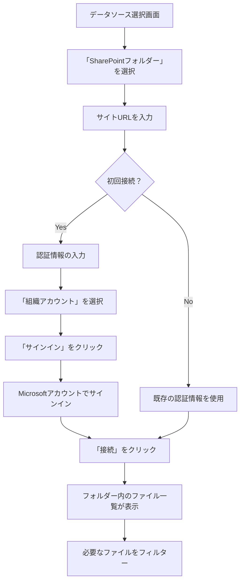
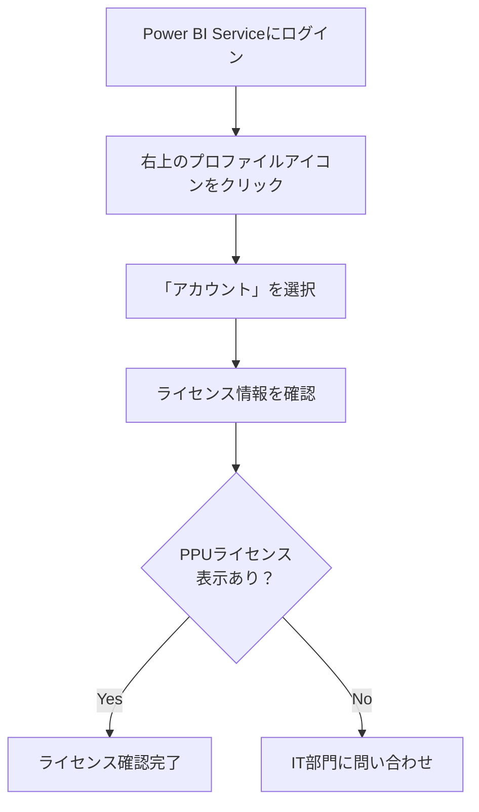
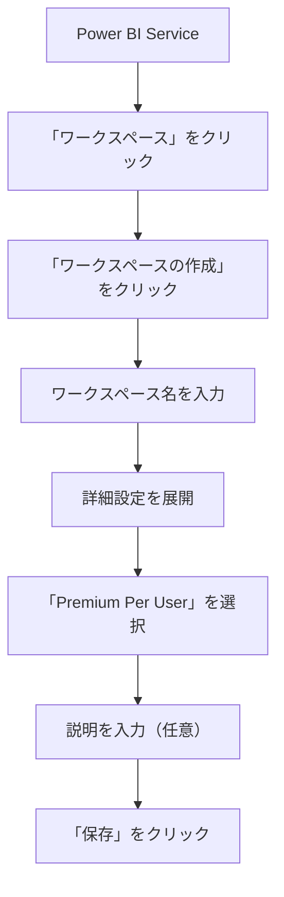

# 環境構築手順

> **ドキュメントバージョン**: 1.0
> **最終更新日**: 2025-12-11
> **前提ドキュメント**: [全体概要](./00_overview.md)

---

## 目次

1. [概要](#1-概要)
2. [前提条件の確認](#2-前提条件の確認)
3. [環境構築フロー](#3-環境構築フロー)
4. [Power BI Service データフローの作成](#4-power-bi-service-データフローの作成)
5. [SharePointデータソースの接続設定](#5-sharepointデータソースの接続設定)
6. [PPUライセンスの確認事項](#6-ppuライセンスの確認事項)
7. [ワークスペース設定](#7-ワークスペース設定)
8. [関連ドキュメント](#8-関連ドキュメント)

---

## 1. 概要

本ドキュメントでは、Power BI Service上でデータフローを構築するための環境構築手順を説明します。

### 構築対象

| 項目 | 内容 |
|------|------|
| データフロー | DF_Staging, DF_Curated |
| データソース | SharePoint Online（CSVファイル） |
| ライセンス | Premium Per User（PPU） |

---

## 2. 前提条件の確認

### 必要なライセンス・権限

### チェックリスト

| # | 確認項目 | 確認方法 | 状態 |
|---|----------|----------|------|
| 1 | PPUライセンスの割り当て | Power BI Serviceにログインし、プロファイル画面で確認 | ☐ |
| 2 | SharePointサイトへのアクセス | データソースフォルダにブラウザでアクセス可能か確認 | ☐ |
| 3 | Power BI ワークスペースへのアクセス | 対象ワークスペースでの編集権限を確認 | ☐ |
| 4 | データゲートウェイ（必要な場合） | オンプレミスデータソースの場合に必要 | ☐ |

---

## 3. 環境構築フロー

### 全体フロー

### 各フェーズの所要時間目安

| フェーズ | 作業内容 | 所要時間目安 |
|----------|----------|--------------|
| Phase 1 | 事前準備 | 30分〜1時間 |
| Phase 2 | データソース設定 | 30分 |
| Phase 3 | データフロー作成 | 2〜4時間 |
| Phase 4 | 検証 | 1〜2時間 |

---

## 4. Power BI Service データフローの作成

### 4.1 Power BI Serviceへのアクセス

1. ブラウザで [Power BI Service](https://app.powerbi.com) にアクセス
2. 組織アカウントでサインイン
3. 左側のナビゲーションから対象ワークスペースを選択

### 4.2 データフロー作成手順

### 4.3 データフローの命名規則

| データフロー | 命名 | 説明 |
|--------------|------|------|
| Staging層 | DF_Staging | 生データの取り込みと正規化 |
| Curated層 | DF_Curated | ビジネスロジック適用後のデータ |

---

## 5. SharePointデータソースの接続設定

### 5.1 接続情報の準備

| 項目 | 説明 | 例 |
|------|------|-----|
| SharePointサイトURL | データが格納されているSharePointサイトのURL | `https://contoso.sharepoint.com/sites/DataSite` |
| フォルダーパス | CSVファイルが格納されているフォルダー | `/Shared Documents/SensorData/` |
| 認証方式 | 組織アカウント（OAuth 2.0） | - |

### 5.2 接続設定手順

### 5.3 認証設定の詳細

| 設定項目 | 推奨値 | 説明 |
|----------|--------|------|
| 認証の種類 | 組織アカウント | Azure AD認証を使用 |
| プライバシーレベル | 組織 | 組織内でのデータ共有を許可 |
| 資格情報の更新 | 手動/自動 | トークンの有効期限に応じて設定 |

### 5.4 接続エラー時の対処

| エラー | 原因 | 対処法 |
|--------|------|--------|
| 401 Unauthorized | 認証情報の期限切れ | 資格情報を更新 |
| 403 Forbidden | アクセス権限なし | SharePoint管理者に権限申請 |
| 404 Not Found | URL誤りまたはフォルダー削除 | URLを再確認 |

---

## 6. PPUライセンスの確認事項

### 6.1 PPUライセンスとは

Premium Per User（PPU）は、ユーザー単位でPremium機能を利用できるライセンスです。

### 6.2 PPUで利用可能な機能

| 機能 | Pro | PPU | 備考 |
|------|-----|-----|------|
| データフロー作成 | ○ | ○ | - |
| 増分更新 | × | ○ | 大規模データに必須 |
| XMLA エンドポイント | × | ○ | 外部ツール連携 |
| ページネーションレポート | × | ○ | - |
| デプロイパイプライン | × | ○ | 開発→本番の移行 |

### 6.3 ライセンス確認手順

### 6.4 ライセンス関連の注意事項

| 注意点 | 詳細 |
|--------|------|
| 共有制限 | PPUコンテンツはPPUユーザーにのみ共有可能 |
| ワークスペース | PPU専用ワークスペースまたはPremium容量ワークスペースが必要 |
| 更新頻度 | 1日最大48回（30分間隔） |

---

## 7. ワークスペース設定

### 7.1 ワークスペースの作成

### 7.2 推奨ワークスペース構成

| ワークスペース | 用途 | 命名例 |
|----------------|------|--------|
| 開発用 | 開発・テスト | WS_保管環境分析_DEV |
| 本番用 | 本番運用 | WS_保管環境分析_PROD |

### 7.3 ワークスペースの権限設定

| ロール | 権限 | 対象者 |
|--------|------|--------|
| 管理者 | フルアクセス | プロジェクトリーダー |
| メンバー | 編集・公開 | 開発者 |
| 共同作成者 | 編集のみ | アナリスト |
| 閲覧者 | 参照のみ | ビジネスユーザー |

### 7.4 ワークスペース設定のベストプラクティス

1. **命名規則の統一**: プレフィックスで環境を識別（DEV/STG/PROD）
2. **アクセス制御**: 最小権限の原則を適用
3. **コンテンツ整理**: フォルダー機能を活用してコンテンツを整理
4. **監査ログ**: 変更履歴を追跡可能にする

---

## 8. 関連ドキュメント

| ドキュメント | 説明 | リンク |
|--------------|------|--------|
| 全体概要 | プロジェクト全体の説明 | [00_overview.md](./00_overview.md) |
| Staging層実装手順 | 次のステップ | [02_staging_layer.md](./02_staging_layer.md) |
| トラブルシューティング | 問題発生時の対処 | [06_troubleshooting.md](./06_troubleshooting.md) |
| 用語集 | 用語の定義 | [07_reference.md](./07_reference.md) |

---

**前のステップ**: [全体概要](./00_overview.md)
**次のステップ**: [Staging層実装手順](./02_staging_layer.md)
