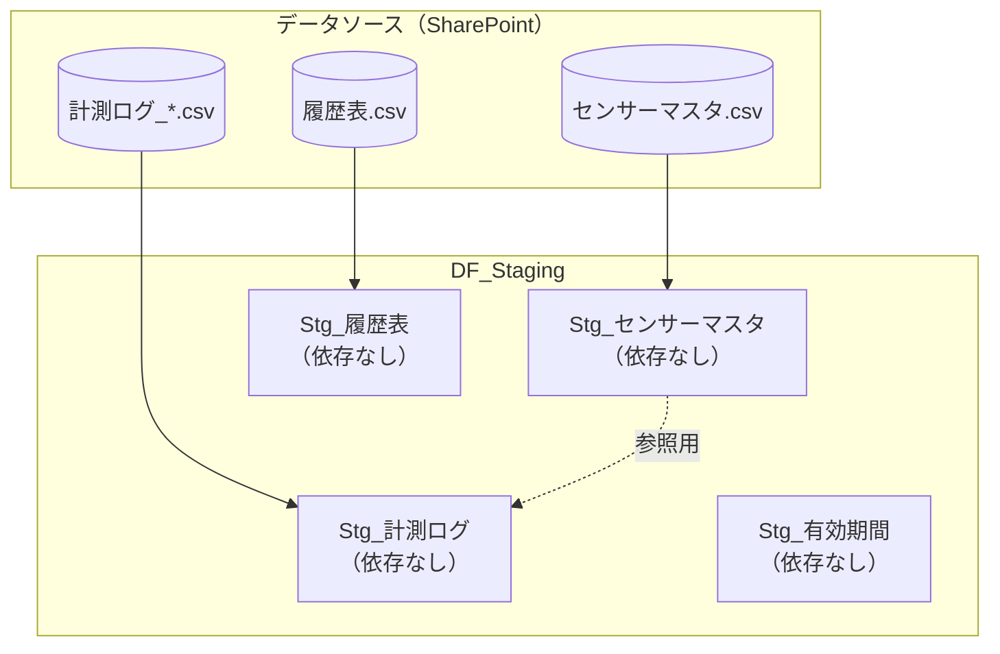
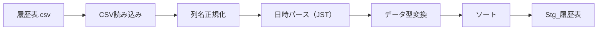
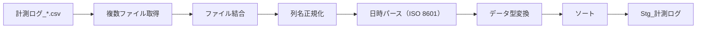
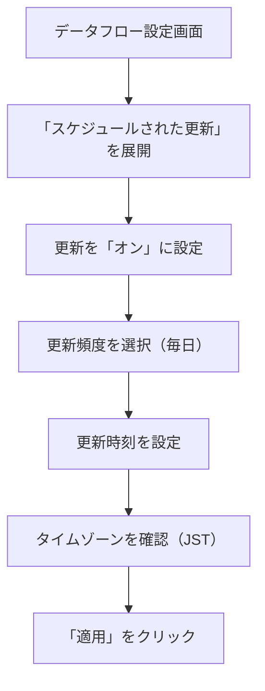

# Staging層実装手順

> **ドキュメントバージョン**: 1.0
> **最終更新日**: 2025-12-11
> **前提ドキュメント**: [環境構築手順](./01_environment_setup.md)

---

## 目次

1. [概要](#1-概要)
2. [DF_Staging データフローの構成](#2-df_staging-データフローの構成)
3. [エンティティ依存関係](#3-エンティティ依存関係)
4. [Stg_センサーマスタ](#4-stg_センサーマスタ)
5. [Stg_履歴表](#5-stg_履歴表)
6. [Stg_計測ログ](#6-stg_計測ログ)
7. [Stg_有効期間](#7-stg_有効期間)
8. [データフロー更新設定](#8-データフロー更新設定)
9. [関連ドキュメント](#9-関連ドキュメント)

---

## 1. 概要

Staging層は、生データを取り込み、基本的な正規化と型変換を行う層です。この層ではビジネスロジックは適用せず、データの整合性確保に注力します。

### 処理方針

| 方針 | 詳細 |
|------|------|
| データ型の統一 | 文字列→適切な型への変換 |
| 列名の正規化 | 日本語列名の維持、空白除去 |
| null値の扱い | 明示的なnull値の保持 |
| 重複排除 | 必要に応じてキー単位で重複排除 |

---

## 2. DF_Staging データフローの構成

### データフロー情報

| 項目 | 値 |
|------|-----|
| データフロー名 | DF_Staging |
| 更新頻度 | 日次 |
| 所要時間目安 | 5〜10分（データ量による） |

### エンティティ一覧

| エンティティ | データソース | 説明 |
|--------------|--------------|------|
| Stg_センサーマスタ | センサーマスタ.csv | センサー基本情報 |
| Stg_履歴表 | 履歴表.csv | 保管場所移動履歴 |
| Stg_計測ログ | 計測ログ_*.csv | 温湿度計測データ（複数ファイル統合） |
| Stg_有効期間 | 手動入力 | データ有効期間定義 |

---

## 3. エンティティ依存関係

### 処理順序フロー



### 依存関係の説明

| エンティティ | 依存先 | 依存内容 |
|--------------|--------|----------|
| Stg_センサーマスタ | なし | 独立して処理可能 |
| Stg_履歴表 | なし | 独立して処理可能 |
| Stg_計測ログ | なし | 独立して処理可能（シリアル検証は任意） |
| Stg_有効期間 | なし | 手動定義のため独立 |

---

## 4. Stg_センサーマスタ

### 4.1 処理概要

センサナンバーとセンサーシリアルの対応表を取り込み、正規化します。


### 4.2 入力スキーマ（CSVファイル）

| 列名 | データ型 | 例 |
|------|----------|-----|
| センサナンバー | text | 40 |
| センサーシリアル | text | Y1044N2VT5C |

### 4.3 出力スキーマ

| 列名 | データ型 | 説明 | 制約 |
|------|----------|------|------|
| センサナンバー | Int64.Type | センサーの識別番号 | PK, NOT NULL |
| センサーシリアル | text | センサーのシリアル番号 | UK, NOT NULL |

### 4.4 Power Query Mコード

```powerquery
let
    // ステップ1: SharePointからCSVファイルを取得
    Source = SharePoint.Files(
        "https://contoso.sharepoint.com/sites/DataSite",
        [ApiVersion = 15]
    ),

    // ステップ2: センサーマスタ.csvをフィルター
    FilteredFile = Table.SelectRows(
        Source,
        each [Name] = "センサーマスタ.csv"
    ),

    // ステップ3: CSVコンテンツを展開
    Content = FilteredFile{0}[Content],

    // ステップ4: CSVとして読み込み（BOM付きUTF-8対応）
    ImportedCSV = Csv.Document(
        Content,
        [
            Delimiter = ",",
            Columns = 2,
            Encoding = 65001,  // UTF-8
            QuoteStyle = QuoteStyle.None
        ]
    ),

    // ステップ5: ヘッダーを昇格
    PromotedHeaders = Table.PromoteHeaders(
        ImportedCSV,
        [PromoteAllScalars = true]
    ),

    // ステップ6: 列名の正規化（前後の空白除去）
    TrimmedColumnNames = Table.TransformColumnNames(
        PromotedHeaders,
        Text.Trim
    ),

    // ステップ7: データ型の変換
    TypedTable = Table.TransformColumnTypes(
        TrimmedColumnNames,
        {
            {"センサナンバー", Int64.Type},
            {"センサーシリアル", type text}
        }
    ),

    // ステップ8: null値を含む行を除外
    RemovedNulls = Table.SelectRows(
        TypedTable,
        each [センサナンバー] <> null and [センサーシリアル] <> null
    ),

    // ステップ9: 重複排除（センサナンバーでユニーク）
    RemovedDuplicates = Table.Distinct(
        RemovedNulls,
        {"センサナンバー"}
    )
in
    RemovedDuplicates
```

### 4.5 サンプルデータ（入出力例）

**入力（CSVファイル）**:
```csv
センサナンバー,センサーシリアル
1,X5001B2TM1H
38,Z7649Q3GH3F
39,Z8120P6KM8R
40,Y1044N2VT5C
41,X0073B9LA2F
42,X8158B4WS1A
```

**出力（テーブル）**:
| センサナンバー | センサーシリアル |
|----------------|------------------|
| 1 | X5001B2TM1H |
| 38 | Z7649Q3GH3F |
| 39 | Z8120P6KM8R |
| 40 | Y1044N2VT5C |
| 41 | X0073B9LA2F |
| 42 | X8158B4WS1A |

---

## 5. Stg_履歴表

### 5.1 処理概要

保管場所の移動履歴を取り込み、日時を正しく解析します。



### 5.2 入力スキーマ（CSVファイル）

| 列名 | データ型 | 例 |
|------|----------|-----|
| センサナンバー | text | 40 |
| LOT | text | Q25X231100 |
| 保管場所 | text | エリアA |
| 日時 | text | 2025/10/23 18:10 |

### 5.3 出力スキーマ

| 列名 | データ型 | 説明 | 制約 |
|------|----------|------|------|
| センサナンバー | Int64.Type | センサーの識別番号 | NOT NULL |
| LOT | text | ロット番号 | NOT NULL |
| 保管場所 | text | 保管エリア名 | NOT NULL |
| 日時 | datetimezone | 移動日時（JST） | NOT NULL |

### 5.4 Power Query Mコード

```powerquery
let
    // ステップ1: SharePointからCSVファイルを取得
    Source = SharePoint.Files(
        "https://contoso.sharepoint.com/sites/DataSite",
        [ApiVersion = 15]
    ),

    // ステップ2: 履歴表.csvをフィルター
    FilteredFile = Table.SelectRows(
        Source,
        each [Name] = "履歴表.csv"
    ),

    // ステップ3: CSVコンテンツを展開
    Content = FilteredFile{0}[Content],

    // ステップ4: CSVとして読み込み
    ImportedCSV = Csv.Document(
        Content,
        [
            Delimiter = ",",
            Columns = 4,
            Encoding = 65001,
            QuoteStyle = QuoteStyle.None
        ]
    ),

    // ステップ5: ヘッダーを昇格
    PromotedHeaders = Table.PromoteHeaders(
        ImportedCSV,
        [PromoteAllScalars = true]
    ),

    // ステップ6: 列名の正規化
    TrimmedColumnNames = Table.TransformColumnNames(
        PromotedHeaders,
        Text.Trim
    ),

    // ステップ7: 日時列のパース（JST: +09:00）
    ParsedDateTime = Table.TransformColumns(
        TrimmedColumnNames,
        {
            {
                "日時",
                each DateTimeZone.FromText(
                    DateTime.ToText(
                        DateTime.FromText(_, [Format = "yyyy/M/d H:mm"]),
                        "yyyy-MM-ddTHH:mm:ss"
                    ) & "+09:00"
                ),
                type datetimezone
            }
        }
    ),

    // ステップ8: 他の列のデータ型変換
    TypedTable = Table.TransformColumnTypes(
        ParsedDateTime,
        {
            {"センサナンバー", Int64.Type},
            {"LOT", type text},
            {"保管場所", type text}
        }
    ),

    // ステップ9: null値を含む行を除外
    RemovedNulls = Table.SelectRows(
        TypedTable,
        each [センサナンバー] <> null
            and [LOT] <> null
            and [保管場所] <> null
            and [日時] <> null
    ),

    // ステップ10: センサナンバーと日時でソート
    SortedTable = Table.Sort(
        RemovedNulls,
        {
            {"センサナンバー", Order.Ascending},
            {"日時", Order.Ascending}
        }
    )
in
    SortedTable
```

### 5.5 サンプルデータ（入出力例）

**入力（CSVファイル）**:
```csv
センサナンバー,LOT,保管場所,日時
40,Q25X231100,エリアA,2025/10/23 18:10
40,Q25X231100,エリアC,2025/10/23 19:25
40,Q25X231100,エリアB,2025/10/23 19:40
```

**出力（テーブル）**:
| センサナンバー | LOT | 保管場所 | 日時 |
|----------------|-----|----------|------|
| 40 | Q25X231100 | エリアA | 2025-10-23T18:10:00+09:00 |
| 40 | Q25X231100 | エリアC | 2025-10-23T19:25:00+09:00 |
| 40 | Q25X231100 | エリアB | 2025-10-23T19:40:00+09:00 |

---

## 6. Stg_計測ログ

### 6.1 処理概要

複数の計測ログCSVファイルを統合し、温湿度データを正規化します。



### 6.2 入力スキーマ（CSVファイル）

| 列名 | データ型 | 例 |
|------|----------|-----|
| created_at | text | 2025-10-11T10:20:22+09:00 |
| field1(Temperature ºC ) | text | 24.621 |
| field2(Humidity) | text | 43.8821 |
| serial | text | X0073B9LA2F |

### 6.3 出力スキーマ

| 列名 | データ型 | 説明 | 制約 |
|------|----------|------|------|
| created_at | datetimezone | 計測日時（JST） | NOT NULL |
| Temperature | Decimal.Type | 温度（℃） | NOT NULL |
| Humidity | Decimal.Type | 相対湿度（%） | NOT NULL |
| serial | text | センサーシリアル | NOT NULL |

### 6.4 Power Query Mコード

```powerquery
let
    // ステップ1: SharePointからファイル一覧を取得
    Source = SharePoint.Files(
        "https://contoso.sharepoint.com/sites/DataSite",
        [ApiVersion = 15]
    ),

    // ステップ2: 計測ログファイルをフィルター（パターン: 計測ログ_*.csv）
    FilteredFiles = Table.SelectRows(
        Source,
        each Text.StartsWith([Name], "計測ログ_")
            and Text.EndsWith([Name], ".csv")
    ),

    // ステップ3: 各CSVファイルの内容を読み込む関数
    ReadCSV = (content as binary) =>
        let
            csv = Csv.Document(
                content,
                [
                    Delimiter = ",",
                    Encoding = 65001,
                    QuoteStyle = QuoteStyle.None
                ]
            ),
            promoted = Table.PromoteHeaders(csv, [PromoteAllScalars = true])
        in
            promoted,

    // ステップ4: 各ファイルのコンテンツを展開
    AddedContent = Table.AddColumn(
        FilteredFiles,
        "TableContent",
        each ReadCSV([Content])
    ),

    // ステップ5: テーブル列を結合
    CombinedTables = Table.Combine(AddedContent[TableContent]),

    // ステップ6: 列名の正規化（温度・湿度列のリネーム）
    RenamedColumns = Table.RenameColumns(
        CombinedTables,
        {
            {"field1(Temperature ºC )", "Temperature"},
            {"field2(Humidity)", "Humidity"}
        }
    ),

    // ステップ7: 列名の空白除去
    TrimmedColumnNames = Table.TransformColumnNames(
        RenamedColumns,
        Text.Trim
    ),

    // ステップ8: 日時列のパース（ISO 8601形式）
    ParsedDateTime = Table.TransformColumns(
        TrimmedColumnNames,
        {
            {
                "created_at",
                each DateTimeZone.FromText(_),
                type datetimezone
            }
        }
    ),

    // ステップ9: 数値列の型変換
    TypedTable = Table.TransformColumnTypes(
        ParsedDateTime,
        {
            {"Temperature", type number},
            {"Humidity", type number},
            {"serial", type text}
        }
    ),

    // ステップ10: null値を含む行を除外
    RemovedNulls = Table.SelectRows(
        TypedTable,
        each [created_at] <> null
            and [Temperature] <> null
            and [Humidity] <> null
            and [serial] <> null
    ),

    // ステップ11: シリアルと日時でソート
    SortedTable = Table.Sort(
        RemovedNulls,
        {
            {"serial", Order.Ascending},
            {"created_at", Order.Ascending}
        }
    ),

    // ステップ12: 重複排除（同一シリアル・同一時刻）
    RemovedDuplicates = Table.Distinct(
        SortedTable,
        {"serial", "created_at"}
    )
in
    RemovedDuplicates
```

### 6.5 サンプルデータ（入出力例）

**入力（CSVファイル）**:
```csv
created_at,field1(Temperature ºC ),field2(Humidity),serial
2025-10-11T10:20:22+09:00,24.621,43.8821,X0073B9LA2F
2025-10-11T10:21:22+09:00,24.59,43.9104,X0073B9LA2F
```

**出力（テーブル）**:
| created_at | Temperature | Humidity | serial |
|------------|-------------|----------|--------|
| 2025-10-11T10:20:22+09:00 | 24.621 | 43.8821 | X0073B9LA2F |
| 2025-10-11T10:21:22+09:00 | 24.59 | 43.9104 | X0073B9LA2F |

---

## 7. Stg_有効期間

### 7.1 処理概要

データの有効期間を定義するマスタテーブルです。分析対象とする期間を制限するために使用します。


### 7.2 出力スキーマ

| 列名 | データ型 | 説明 | 制約 |
|------|----------|------|------|
| 有効期間ID | Int64.Type | 期間の識別子 | PK |
| 開始日時 | datetimezone | 有効期間の開始 | NOT NULL |
| 終了日時 | datetimezone | 有効期間の終了 | NOT NULL |
| 説明 | text | 期間の説明 | - |

### 7.3 Power Query Mコード

```powerquery
let
    // 有効期間のテーブルを手動定義
    Source = Table.FromRecords(
        {
            [
                有効期間ID = 1,
                開始日時 = DateTimeZone.FromText("2025-10-01T00:00:00+09:00"),
                終了日時 = DateTimeZone.FromText("2025-12-31T23:59:59+09:00"),
                説明 = "2025年度下期"
            ],
            [
                有効期間ID = 2,
                開始日時 = DateTimeZone.FromText("2026-01-01T00:00:00+09:00"),
                終了日時 = DateTimeZone.FromText("2026-03-31T23:59:59+09:00"),
                説明 = "2025年度Q4"
            ]
        }
    ),

    // データ型の設定
    TypedTable = Table.TransformColumnTypes(
        Source,
        {
            {"有効期間ID", Int64.Type},
            {"開始日時", type datetimezone},
            {"終了日時", type datetimezone},
            {"説明", type text}
        }
    )
in
    TypedTable
```

### 7.4 サンプルデータ（出力例）

| 有効期間ID | 開始日時 | 終了日時 | 説明 |
|------------|----------|----------|------|
| 1 | 2025-10-01T00:00:00+09:00 | 2025-12-31T23:59:59+09:00 | 2025年度下期 |
| 2 | 2026-01-01T00:00:00+09:00 | 2026-03-31T23:59:59+09:00 | 2025年度Q4 |

---

## 8. データフロー更新設定

### 8.1 更新スケジュールの設定



### 8.2 推奨設定

| 設定項目 | 推奨値 | 理由 |
|----------|--------|------|
| 更新頻度 | 毎日 | データソースの更新頻度に合わせる |
| 更新時刻 | 06:00 (JST) | 業務開始前にデータを準備 |
| 失敗通知 | オン | 問題の早期発見 |
| タイムアウト | 2時間 | 大量データに対応 |

### 8.3 更新順序の注意

DF_Staging → DF_Curated の順序で更新されるように設定してください。

---

## 9. 関連ドキュメント

| ドキュメント | 説明 | リンク |
|--------------|------|--------|
| 全体概要 | プロジェクト全体の説明 | [00_overview.md](./00_overview.md) |
| 環境構築手順 | 前のステップ | [01_environment_setup.md](./01_environment_setup.md) |
| Curated層実装手順 | 次のステップ | [03_curated_layer.md](./03_curated_layer.md) |
| 区間JOIN処理詳細 | FillDown処理の詳細 | [04_interval_join_logic.md](./04_interval_join_logic.md) |
| トラブルシューティング | 問題発生時の対処 | [06_troubleshooting.md](./06_troubleshooting.md) |

---

**前のステップ**: [環境構築手順](./01_environment_setup.md)
**次のステップ**: [Curated層実装手順](./03_curated_layer.md)
