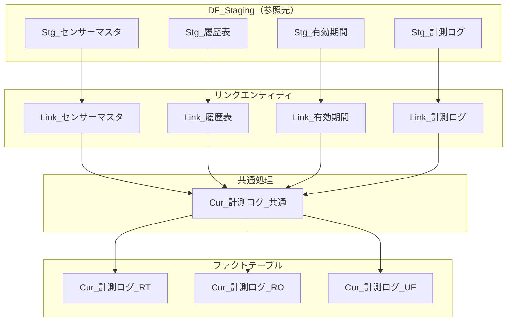
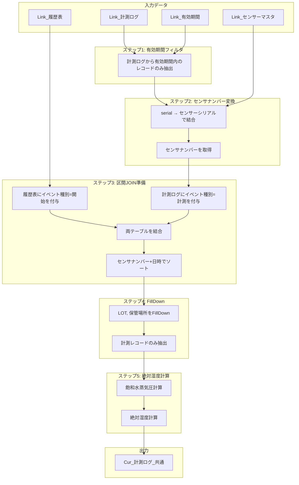
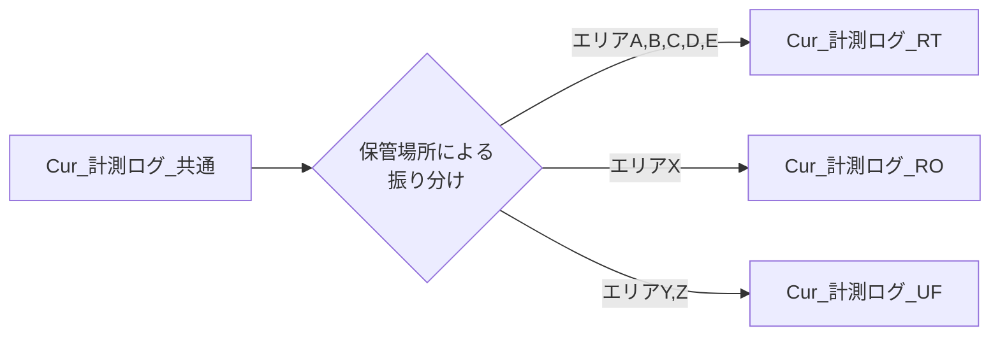
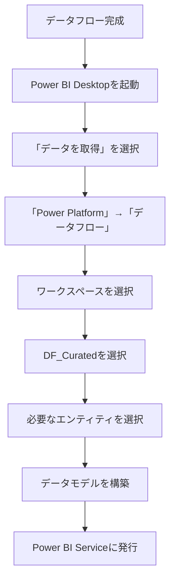
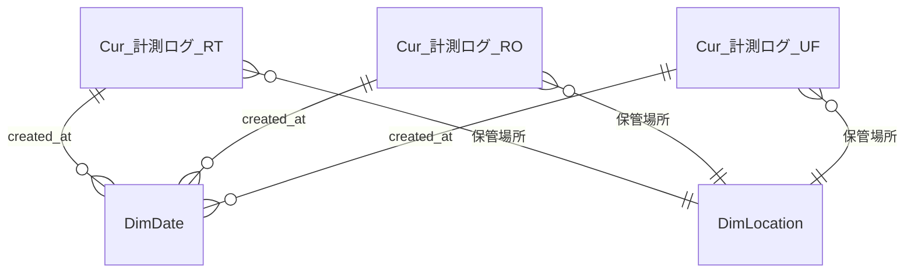

# Curated層実装手順

> **ドキュメントバージョン**: 1.0
> **最終更新日**: 2025-12-11
> **前提ドキュメント**: [Staging層実装手順](./02_staging_layer.md)

---

## 目次

1. [概要](#1-概要)
2. [DF_Curated データフローの構成](#2-df_curated-データフローの構成)
3. [エンティティ依存関係](#3-エンティティ依存関係)
4. [リンクエンティティ](#4-リンクエンティティ)
5. [Cur_計測ログ_共通](#5-cur_計測ログ_共通)
6. [工程区分別ファクトテーブル](#6-工程区分別ファクトテーブル)
7. [セマンティックモデルへの接続](#7-セマンティックモデルへの接続)
8. [関連ドキュメント](#8-関連ドキュメント)

---

## 1. 概要

Curated層は、Staging層のデータにビジネスロジックを適用し、分析に適した形式に変換する層です。

### 処理方針

| 方針 | 詳細 |
|------|------|
| 区間JOIN | FillDownによる履歴表との突合 |
| 派生列の計算 | 絶対湿度の算出 |
| 工程区分別分割 | RT/RO/UFへのデータ振り分け |
| 有効期間フィルタ | 分析対象期間の絞り込み |

---

## 2. DF_Curated データフローの構成

### データフロー情報

| 項目 | 値 |
|------|-----|
| データフロー名 | DF_Curated |
| 依存データフロー | DF_Staging |
| 更新頻度 | 日次（DF_Staging更新後） |

### エンティティ一覧

| カテゴリ | エンティティ | 説明 |
|----------|--------------|------|
| リンク | Link_センサーマスタ | Staging層からの参照 |
| リンク | Link_履歴表 | Staging層からの参照 |
| リンク | Link_有効期間 | Staging層からの参照 |
| リンク | Link_計測ログ | Staging層からの参照 |
| 共通処理 | Cur_計測ログ_共通 | 区間JOIN・絶対湿度計算後 |
| ファクト | Cur_計測ログ_RT | 常温工程ファクト |
| ファクト | Cur_計測ログ_RO | 逆浸透工程ファクト |
| ファクト | Cur_計測ログ_UF | 限外ろ過工程ファクト |

---

## 3. エンティティ依存関係

### 処理順序フロー



### 依存関係マトリクス

| エンティティ | 依存先 | 処理順序 |
|--------------|--------|----------|
| Link_* | Stg_* | 1 |
| Cur_計測ログ_共通 | Link_* 全て | 2 |
| Cur_計測ログ_RT/RO/UF | Cur_計測ログ_共通 | 3 |

---

## 4. リンクエンティティ

リンクエンティティは、Staging層のデータを参照するためのエンティティです。

### 4.1 Link_センサーマスタ

```powerquery
let
    Source = PowerPlatform.Dataflows(null),
    Workspace = Source{[workspaceId = "YOUR_WORKSPACE_ID"]}[Data],
    Dataflow = Workspace{[dataflowId = "DF_STAGING_ID"]}[Data],
    Entity = Dataflow{[entity = "Stg_センサーマスタ"]}[Data]
in
    Entity
```

### 4.2 Link_履歴表

```powerquery
let
    Source = PowerPlatform.Dataflows(null),
    Workspace = Source{[workspaceId = "YOUR_WORKSPACE_ID"]}[Data],
    Dataflow = Workspace{[dataflowId = "DF_STAGING_ID"]}[Data],
    Entity = Dataflow{[entity = "Stg_履歴表"]}[Data]
in
    Entity
```

### 4.3 Link_有効期間

```powerquery
let
    Source = PowerPlatform.Dataflows(null),
    Workspace = Source{[workspaceId = "YOUR_WORKSPACE_ID"]}[Data],
    Dataflow = Workspace{[dataflowId = "DF_STAGING_ID"]}[Data],
    Entity = Dataflow{[entity = "Stg_有効期間"]}[Data]
in
    Entity
```

### 4.4 Link_計測ログ

```powerquery
let
    Source = PowerPlatform.Dataflows(null),
    Workspace = Source{[workspaceId = "YOUR_WORKSPACE_ID"]}[Data],
    Dataflow = Workspace{[dataflowId = "DF_STAGING_ID"]}[Data],
    Entity = Dataflow{[entity = "Stg_計測ログ"]}[Data]
in
    Entity
```

---

## 5. Cur_計測ログ_共通

### 5.1 処理概要

このエンティティは、計測ログに対して以下の処理を行います：

1. 有効期間フィルタ
2. センサーシリアル→センサナンバー変換
3. 区間JOIN（FillDown）による履歴表との突合
4. 絶対湿度の計算

### 5.2 処理フロー詳細



### 5.3 入力スキーマ

**Link_計測ログ**:
| 列名 | データ型 |
|------|----------|
| created_at | datetimezone |
| Temperature | number |
| Humidity | number |
| serial | text |

**Link_センサーマスタ**:
| 列名 | データ型 |
|------|----------|
| センサナンバー | Int64.Type |
| センサーシリアル | text |

**Link_履歴表**:
| 列名 | データ型 |
|------|----------|
| センサナンバー | Int64.Type |
| LOT | text |
| 保管場所 | text |
| 日時 | datetimezone |

### 5.4 出力スキーマ

| 列名 | データ型 | 説明 |
|------|----------|------|
| created_at | datetimezone | 計測日時 |
| センサナンバー | Int64.Type | センサー識別番号 |
| LOT | text | ロット番号 |
| 保管場所 | text | 保管エリア |
| Temperature | number | 温度（℃） |
| Humidity | number | 相対湿度（%） |
| AbsoluteHumidity | number | 絶対湿度（g/m³） |

### 5.5 Power Query Mコード

```powerquery
let
    // ==================================================
    // 入力データの取得
    // ==================================================

    // リンクエンティティから取得
    計測ログ = Link_計測ログ,
    センサーマスタ = Link_センサーマスタ,
    履歴表 = Link_履歴表,
    有効期間 = Link_有効期間,

    // ==================================================
    // ステップ1: 有効期間フィルタ
    // ==================================================

    // 最新の有効期間を取得
    CurrentPeriod = Table.Last(
        Table.Sort(有効期間, {"有効期間ID", Order.Ascending})
    ),
    StartDate = CurrentPeriod[開始日時],
    EndDate = CurrentPeriod[終了日時],

    // 有効期間内の計測ログのみ抽出
    FilteredByPeriod = Table.SelectRows(
        計測ログ,
        each [created_at] >= StartDate and [created_at] <= EndDate
    ),

    // ==================================================
    // ステップ2: センサナンバー変換
    // ==================================================

    // 計測ログにセンサナンバーを結合
    JoinedWithSensor = Table.NestedJoin(
        FilteredByPeriod,
        {"serial"},
        センサーマスタ,
        {"センサーシリアル"},
        "SensorInfo",
        JoinKind.Inner
    ),

    // センサナンバーを展開
    ExpandedSensor = Table.ExpandTableColumn(
        JoinedWithSensor,
        "SensorInfo",
        {"センサナンバー"},
        {"センサナンバー"}
    ),

    // ==================================================
    // ステップ3: 区間JOIN準備
    // ==================================================

    // 履歴表にイベント種別を付与（開始イベント）
    HistoryWithEventType = Table.AddColumn(
        履歴表,
        "EventType",
        each "開始",
        type text
    ),

    // 計測ログにイベント種別を付与（計測イベント）
    MeasurementWithEventType = Table.AddColumn(
        ExpandedSensor,
        "EventType",
        each "計測",
        type text
    ),

    // 計測ログの日時列をリネーム（統合用）
    MeasurementRenamed = Table.RenameColumns(
        MeasurementWithEventType,
        {{"created_at", "日時"}}
    ),

    // 履歴表の列を選択（統合用）
    HistorySelected = Table.SelectColumns(
        HistoryWithEventType,
        {"センサナンバー", "LOT", "保管場所", "日時", "EventType"}
    ),

    // 計測ログに結合用のダミー列を追加
    MeasurementWithDummy = Table.AddColumn(
        Table.AddColumn(
            MeasurementRenamed,
            "LOT_Event",
            each null,
            type text
        ),
        "保管場所_Event",
        each null,
        type text
    ),

    // 列を選択して統合準備
    MeasurementForUnion = Table.SelectColumns(
        MeasurementWithDummy,
        {"センサナンバー", "日時", "Temperature", "Humidity", "serial",
         "LOT_Event", "保管場所_Event", "EventType"}
    ),

    // 履歴表にダミー列を追加
    HistoryWithDummy = Table.AddColumn(
        Table.AddColumn(
            Table.AddColumn(
                Table.AddColumn(
                    HistorySelected,
                    "Temperature",
                    each null,
                    type number
                ),
                "Humidity",
                each null,
                type number
            ),
            "serial",
            each null,
            type text
        ),
        "LOT_Event",
        each [LOT],
        type text
    ),

    HistoryForUnion = Table.AddColumn(
        HistoryWithDummy,
        "保管場所_Event",
        each [保管場所],
        type text
    ),

    HistoryFinal = Table.SelectColumns(
        HistoryForUnion,
        {"センサナンバー", "日時", "Temperature", "Humidity", "serial",
         "LOT_Event", "保管場所_Event", "EventType"}
    ),

    // 両テーブルを結合
    CombinedTable = Table.Combine({HistoryFinal, MeasurementForUnion}),

    // ==================================================
    // ステップ4: ソートとFillDown
    // ==================================================

    // センサナンバーと日時でソート
    SortedTable = Table.Sort(
        CombinedTable,
        {
            {"センサナンバー", Order.Ascending},
            {"日時", Order.Ascending}
        }
    ),

    // センサナンバーでグループ化してFillDown
    GroupedForFillDown = Table.Group(
        SortedTable,
        {"センサナンバー"},
        {
            {"GroupedData", each Table.FillDown(_, {"LOT_Event", "保管場所_Event"})}
        }
    ),

    // グループ化を展開
    ExpandedFillDown = Table.ExpandTableColumn(
        GroupedForFillDown,
        "GroupedData",
        {"日時", "Temperature", "Humidity", "serial",
         "LOT_Event", "保管場所_Event", "EventType"}
    ),

    // 計測レコードのみ抽出
    MeasurementOnly = Table.SelectRows(
        ExpandedFillDown,
        each [EventType] = "計測"
    ),

    // 列名を整理
    RenamedColumns = Table.RenameColumns(
        MeasurementOnly,
        {
            {"日時", "created_at"},
            {"LOT_Event", "LOT"},
            {"保管場所_Event", "保管場所"}
        }
    ),

    // 不要な列を削除
    CleanedColumns = Table.RemoveColumns(
        RenamedColumns,
        {"EventType", "serial"}
    ),

    // ==================================================
    // ステップ5: 絶対湿度計算
    // ==================================================

    // 絶対湿度計算関数
    // 公式: AH = (RH / 100) * 6.112 * exp((17.67 * T) / (T + 243.5)) * 2.1674 / (273.15 + T)
    // T: 温度（℃）, RH: 相対湿度（%）, AH: 絶対湿度（g/m³）

    AddAbsoluteHumidity = Table.AddColumn(
        CleanedColumns,
        "AbsoluteHumidity",
        each
            let
                T = [Temperature],
                RH = [Humidity],
                // 飽和水蒸気圧（hPa）
                Es = 6.112 * Number.Exp((17.67 * T) / (T + 243.5)),
                // 絶対湿度（g/m³）
                AH = (RH / 100) * Es * 2.1674 / (273.15 + T)
            in
                AH,
        type number
    ),

    // ==================================================
    // 最終出力
    // ==================================================

    // 列順序を整理
    FinalOutput = Table.SelectColumns(
        AddAbsoluteHumidity,
        {
            "created_at",
            "センサナンバー",
            "LOT",
            "保管場所",
            "Temperature",
            "Humidity",
            "AbsoluteHumidity"
        }
    ),

    // データ型を最終設定
    TypedOutput = Table.TransformColumnTypes(
        FinalOutput,
        {
            {"created_at", type datetimezone},
            {"センサナンバー", Int64.Type},
            {"LOT", type text},
            {"保管場所", type text},
            {"Temperature", type number},
            {"Humidity", type number},
            {"AbsoluteHumidity", type number}
        }
    )
in
    TypedOutput
```

### 5.6 絶対湿度計算の詳細

絶対湿度は以下の公式で計算されます：

```
飽和水蒸気圧: Es = 6.112 × exp((17.67 × T) / (T + 243.5))
絶対湿度: AH = (RH / 100) × Es × 2.1674 / (273.15 + T)
```

| 変数 | 単位 | 説明 |
|------|------|------|
| T | ℃ | 温度 |
| RH | % | 相対湿度 |
| Es | hPa | 飽和水蒸気圧 |
| AH | g/m³ | 絶対湿度 |

### 5.7 サンプルデータ（入出力例）

**処理前**:
| created_at | Temperature | Humidity | serial |
|------------|-------------|----------|--------|
| 2025-10-23T18:15:00+09:00 | 24.5 | 45.0 | Y1044N2VT5C |
| 2025-10-23T19:30:00+09:00 | 23.8 | 48.2 | Y1044N2VT5C |

**処理後**:
| created_at | センサナンバー | LOT | 保管場所 | Temperature | Humidity | AbsoluteHumidity |
|------------|----------------|-----|----------|-------------|----------|------------------|
| 2025-10-23T18:15:00+09:00 | 40 | Q25X231100 | エリアA | 24.5 | 45.0 | 9.89 |
| 2025-10-23T19:30:00+09:00 | 40 | Q25X231100 | エリアC | 23.8 | 48.2 | 10.17 |

---

## 6. 工程区分別ファクトテーブル

### 6.1 概要

Cur_計測ログ_共通から保管場所に基づいて工程区分別にデータを分割します。



### 6.2 工程区分とエリアの対応

| 工程区分 | コード | 対象エリア | 説明 |
|----------|--------|------------|------|
| 常温 | RT | エリアA, B, C, D, E | 常温保管エリア |
| 逆浸透 | RO | エリアX | RO工程エリア |
| 限外ろ過 | UF | エリアY, Z | UF工程エリア |

### 6.3 Cur_計測ログ_RT

```powerquery
let
    Source = Cur_計測ログ_共通,

    // RT対象エリアでフィルター
    RTAreas = {"エリアA", "エリアB", "エリアC", "エリアD", "エリアE"},

    Filtered = Table.SelectRows(
        Source,
        each List.Contains(RTAreas, [保管場所])
    ),

    // 工程区分列を追加
    AddProcessType = Table.AddColumn(
        Filtered,
        "工程区分",
        each "RT",
        type text
    )
in
    AddProcessType
```

### 6.4 Cur_計測ログ_RO

```powerquery
let
    Source = Cur_計測ログ_共通,

    // RO対象エリアでフィルター
    ROAreas = {"エリアX"},

    Filtered = Table.SelectRows(
        Source,
        each List.Contains(ROAreas, [保管場所])
    ),

    // 工程区分列を追加
    AddProcessType = Table.AddColumn(
        Filtered,
        "工程区分",
        each "RO",
        type text
    )
in
    AddProcessType
```

### 6.5 Cur_計測ログ_UF

```powerquery
let
    Source = Cur_計測ログ_共通,

    // UF対象エリアでフィルター
    UFAreas = {"エリアY", "エリアZ"},

    Filtered = Table.SelectRows(
        Source,
        each List.Contains(UFAreas, [保管場所])
    ),

    // 工程区分列を追加
    AddProcessType = Table.AddColumn(
        Filtered,
        "工程区分",
        each "UF",
        type text
    )
in
    AddProcessType
```

### 6.6 出力スキーマ（共通）

| 列名 | データ型 | 説明 |
|------|----------|------|
| created_at | datetimezone | 計測日時 |
| センサナンバー | Int64.Type | センサー識別番号 |
| LOT | text | ロット番号 |
| 保管場所 | text | 保管エリア |
| Temperature | number | 温度（℃） |
| Humidity | number | 相対湿度（%） |
| AbsoluteHumidity | number | 絶対湿度（g/m³） |
| 工程区分 | text | RT/RO/UF |

---

## 7. セマンティックモデルへの接続

### 7.1 セマンティックモデルの作成



### 7.2 推奨リレーションシップ



---

## 8. 関連ドキュメント

| ドキュメント | 説明 | リンク |
|--------------|------|--------|
| 全体概要 | プロジェクト全体の説明 | [00_overview.md](./00_overview.md) |
| Staging層実装手順 | 前のステップ | [02_staging_layer.md](./02_staging_layer.md) |
| 区間JOIN処理詳細 | FillDown処理の詳細解説 | [04_interval_join_logic.md](./04_interval_join_logic.md) |
| テスト手順 | テスト方法 | [05_testing_procedure.md](./05_testing_procedure.md) |
| トラブルシューティング | 問題発生時の対処 | [06_troubleshooting.md](./06_troubleshooting.md) |

---

**前のステップ**: [Staging層実装手順](./02_staging_layer.md)
**次のステップ**: [区間JOIN処理詳細](./04_interval_join_logic.md)
