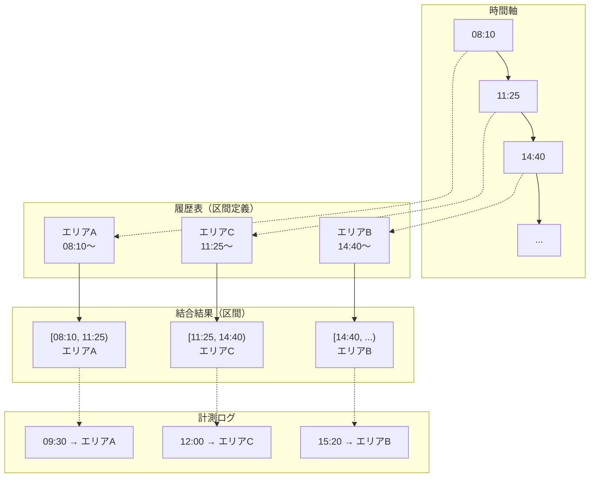
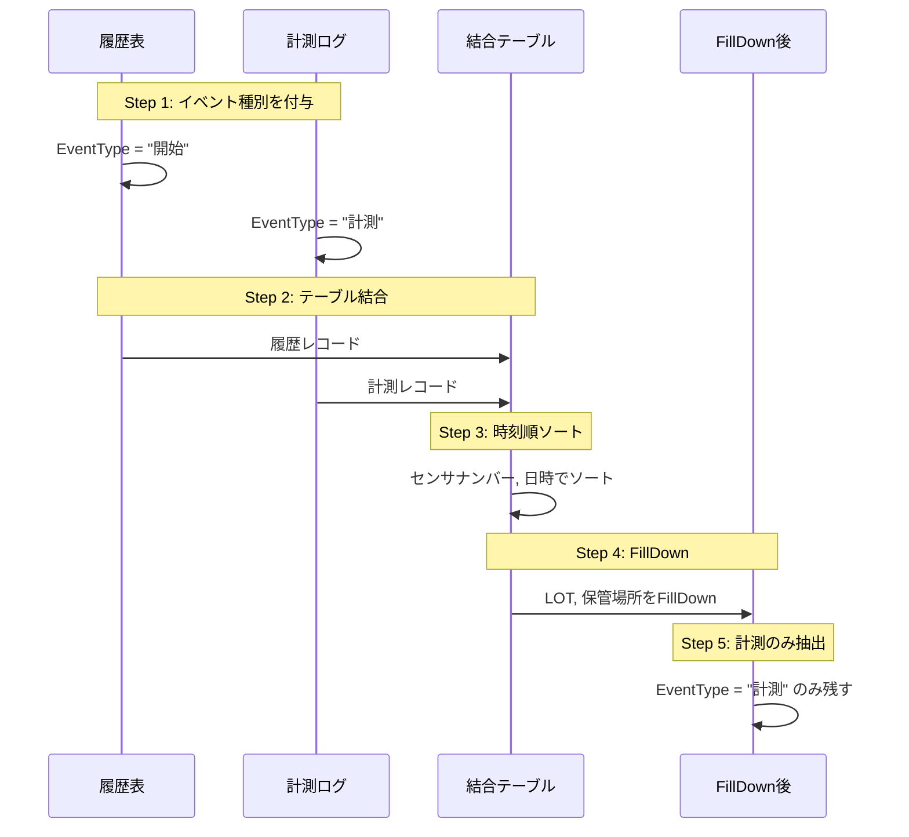
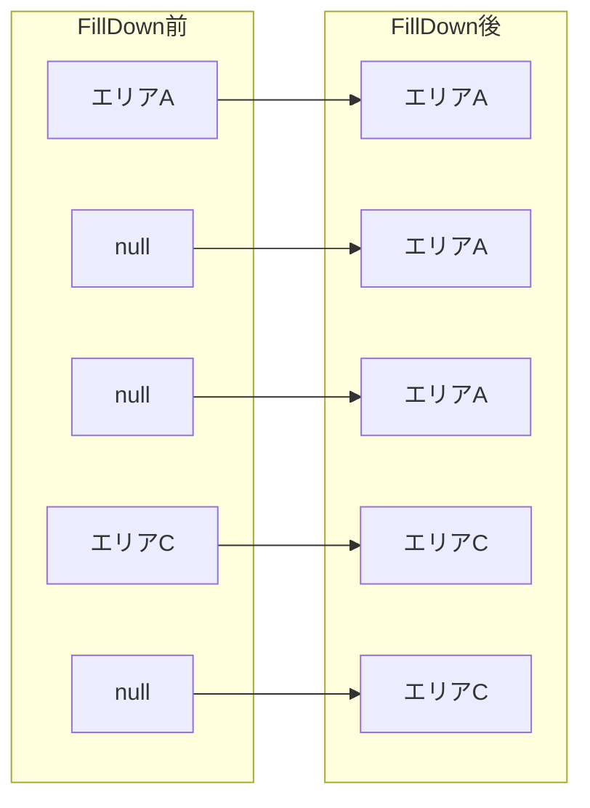
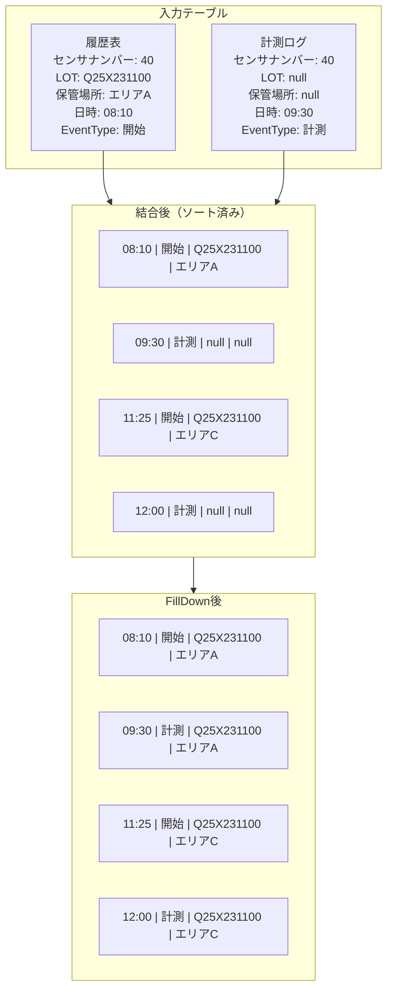
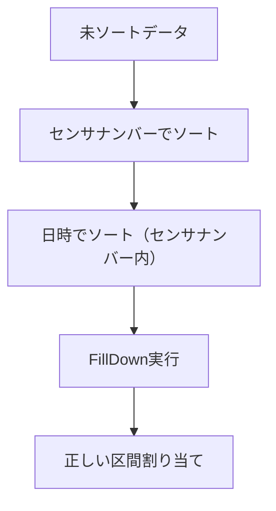
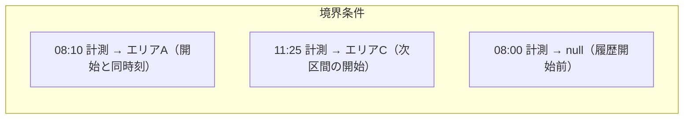
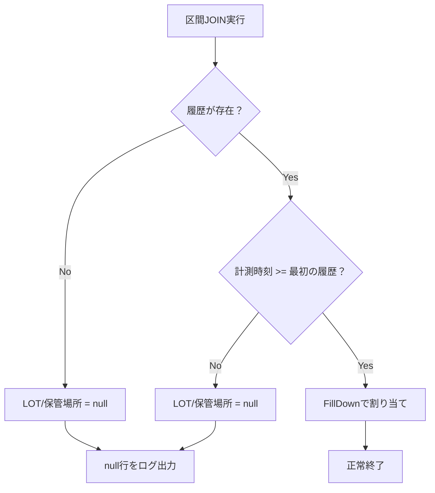

# 区間JOIN処理の詳細

> **ドキュメントバージョン**: 1.0
> **最終更新日**: 2025-12-11
> **前提ドキュメント**: [Curated層実装手順](./03_curated_layer.md)

---

## 目次

1. [概要](#1-概要)
2. [区間JOINの概念](#2-区間joinの概念)
3. [FillDownによる実装](#3-filldownによる実装)
4. [ソートキーの設計](#4-ソートキーの設計)
5. [境界条件の扱い](#5-境界条件の扱い)
6. [具体的なデータ例](#6-具体的なデータ例)
7. [実装上の注意点](#7-実装上の注意点)
8. [関連ドキュメント](#8-関連ドキュメント)

---

## 1. 概要

区間JOIN（Interval JOIN）は、時間範囲に基づいてデータを結合する処理です。本プロジェクトでは、**履歴表の保管場所情報を計測ログの各レコードに紐付ける**ために使用します。

### 課題

| 課題 | 説明 |
|------|------|
| 結合キーの不一致 | 計測ログの時刻は履歴表の時刻と完全一致しない |
| 区間の特定 | 計測時刻がどの保管場所区間に属するかを判定する必要がある |
| パフォーマンス | 大量データに対して効率的に処理する必要がある |

### 解決策：FillDown

Power QueryのFillDown機能を使用して、区間JOINを実現します。

---

## 2. 区間JOINの概念

### 2.1 概念図



### 2.2 区間の定義

```mermaid
gantt
    title 保管場所の時間区間（センサナンバー40）
    dateFormat HH:mm
    axisFormat %H:%M

    section エリア
    エリアA (08:10-11:25) :a1, 08:10, 195m
    エリアC (11:25-14:40) :a2, 11:25, 195m
    エリアB (14:40-) :a3, 14:40, 180m
```



### 2.3 半開区間の考え方

区間は **[start, next_start)** の半開区間として扱います。

| 表記 | 意味 |
|------|------|
| `[` | 開始時刻を含む（inclusive） |
| `)` | 終了時刻を含まない（exclusive） |

**例**: `[08:10, 11:25)` は、08:10:00 以上 11:25:00 未満の時刻を含む

---

## 3. FillDownによる実装

### 3.1 処理の流れ



### 3.2 FillDownの動作原理

FillDownは、null値を**上方の最新のnull以外の値**で埋める処理です。



### 3.3 テーブル結合の詳細



---

## 4. ソートキーの設計

### 4.1 ソートキーの重要性

FillDownが正しく動作するためには、**適切な順序でレコードがソートされている必要**があります。

### 4.2 ソートキーの設計

| 優先度 | 列名 | ソート順 | 理由 |
|--------|------|----------|------|
| 1 | センサナンバー | 昇順 | センサー単位でグループ化 |
| 2 | 日時 | 昇順 | 時系列順にFillDown |

### 4.3 ソート順のフロー



### 4.4 Power Queryでのソート実装

```powerquery
// センサナンバーと日時でソート
SortedTable = Table.Sort(
    CombinedTable,
    {
        {"センサナンバー", Order.Ascending},
        {"日時", Order.Ascending}
    }
)
```

---

## 5. 境界条件の扱い

### 5.1 境界条件の種類

| 条件 | 説明 | 対処法 |
|------|------|--------|
| 開始境界 | 計測時刻 = 区間開始時刻 | その区間に含める |
| 終了境界 | 計測時刻 = 次区間開始時刻 | 次の区間に含める |
| 区間開始前 | 計測時刻 < 最初の履歴時刻 | null（または除外） |
| 区間終了後 | 計測時刻 > 最後の履歴時刻 | 最後の区間に含める |

### 5.2 境界の図解



### 5.3 半開区間 [start, next_start) の実装

FillDownを使用した実装では、**履歴レコードを先にソート**することで自動的に半開区間が実現されます。

```
時刻順: 08:10(履歴) → 08:10(計測) → 11:25(履歴) → 11:25(計測)
↓
08:10の計測 → エリアA（08:10の履歴がFillDownされる）
11:25の計測 → エリアC（11:25の履歴がFillDownされる）
```

### 5.4 同一時刻の処理順序

同一時刻に履歴と計測の両方がある場合の処理順序：

```powerquery
// 同一時刻の場合、履歴（開始）を先にするためのソート
SortedTable = Table.Sort(
    CombinedTable,
    {
        {"センサナンバー", Order.Ascending},
        {"日時", Order.Ascending},
        {"EventType", Order.Ascending}  // "開始" < "計測"
    }
)
```

---

## 6. 具体的なデータ例

### 6.1 入力データ

**履歴表（センサナンバー40）**:
| センサナンバー | LOT | 保管場所 | 日時 |
|----------------|-----|----------|------|
| 40 | Q25X231100 | エリアA | 2025/10/23 18:10 |
| 40 | Q25X231100 | エリアC | 2025/10/23 19:25 |
| 40 | Q25X231100 | エリアB | 2025/10/23 19:40 |

**計測ログ（センサナンバー40）**:
| created_at | Temperature | Humidity | serial |
|------------|-------------|----------|--------|
| 2025-10-23T18:15:00+09:00 | 24.5 | 45.0 | Y1044N2VT5C |
| 2025-10-23T19:00:00+09:00 | 24.2 | 46.1 | Y1044N2VT5C |
| 2025-10-23T19:30:00+09:00 | 23.8 | 48.2 | Y1044N2VT5C |
| 2025-10-23T20:00:00+09:00 | 23.5 | 49.0 | Y1044N2VT5C |

### 6.2 処理ステップ

#### Step 1: イベント種別付与・結合

| センサナンバー | 日時 | EventType | LOT | 保管場所 | Temperature | Humidity |
|----------------|------|-----------|-----|----------|-------------|----------|
| 40 | 18:10 | 開始 | Q25X231100 | エリアA | null | null |
| 40 | 18:15 | 計測 | null | null | 24.5 | 45.0 |
| 40 | 19:00 | 計測 | null | null | 24.2 | 46.1 |
| 40 | 19:25 | 開始 | Q25X231100 | エリアC | null | null |
| 40 | 19:30 | 計測 | null | null | 23.8 | 48.2 |
| 40 | 19:40 | 開始 | Q25X231100 | エリアB | null | null |
| 40 | 20:00 | 計測 | null | null | 23.5 | 49.0 |

#### Step 2: FillDown適用後

| センサナンバー | 日時 | EventType | LOT | 保管場所 | Temperature | Humidity |
|----------------|------|-----------|-----|----------|-------------|----------|
| 40 | 18:10 | 開始 | Q25X231100 | **エリアA** | null | null |
| 40 | 18:15 | 計測 | Q25X231100 | **エリアA** | 24.5 | 45.0 |
| 40 | 19:00 | 計測 | Q25X231100 | **エリアA** | 24.2 | 46.1 |
| 40 | 19:25 | 開始 | Q25X231100 | **エリアC** | null | null |
| 40 | 19:30 | 計測 | Q25X231100 | **エリアC** | 23.8 | 48.2 |
| 40 | 19:40 | 開始 | Q25X231100 | **エリアB** | null | null |
| 40 | 20:00 | 計測 | Q25X231100 | **エリアB** | 23.5 | 49.0 |

#### Step 3: 計測レコードのみ抽出

| センサナンバー | 日時 | LOT | 保管場所 | Temperature | Humidity |
|----------------|------|-----|----------|-------------|----------|
| 40 | 18:15 | Q25X231100 | エリアA | 24.5 | 45.0 |
| 40 | 19:00 | Q25X231100 | エリアA | 24.2 | 46.1 |
| 40 | 19:30 | Q25X231100 | エリアC | 23.8 | 48.2 |
| 40 | 20:00 | Q25X231100 | エリアB | 23.5 | 49.0 |

### 6.3 処理結果の検証

```mermaid
gantt
    title 区間JOINの検証（センサナンバー40）
    dateFormat HH:mm
    axisFormat %H:%M

    section 履歴区間
    エリアA :active, a1, 18:10, 75m
    エリアC :active, a2, 19:25, 15m
    エリアB :active, a3, 19:40, 30m

    section 計測ポイント
    18:15 → エリアA :milestone, m1, 18:15, 0m
    19:00 → エリアA :milestone, m2, 19:00, 0m
    19:30 → エリアC :milestone, m3, 19:30, 0m
    20:00 → エリアB :milestone, m4, 20:00, 0m
```

---

## 7. 実装上の注意点

### 7.1 パフォーマンス最適化

| 最適化 | 方法 | 効果 |
|--------|------|------|
| 事前フィルタ | 有効期間でフィルタしてからJOIN | データ量削減 |
| グループ化 | センサナンバー単位でグループ化 | メモリ効率向上 |
| インデックス | ソートキーの最適化 | ソート速度向上 |

### 7.2 エラー処理



### 7.3 よくある問題

| 問題 | 原因 | 対策 |
|------|------|------|
| 保管場所がnull | 履歴開始前の計測 | 有効期間フィルタで除外 |
| 誤った区間割り当て | ソート順の誤り | ソートキーを確認 |
| 重複レコード | 同一時刻の履歴 | 重複排除処理を追加 |

### 7.4 デバッグ方法

1. **中間結果の確認**: 各ステップ後のテーブルを確認
2. **サンプルデータでテスト**: 少量データで動作検証
3. **境界値テスト**: 区間境界での動作確認

---

## 8. 関連ドキュメント

| ドキュメント | 説明 | リンク |
|--------------|------|--------|
| Curated層実装手順 | 前のステップ | [03_curated_layer.md](./03_curated_layer.md) |
| テスト手順 | 区間JOINのテスト方法 | [05_testing_procedure.md](./05_testing_procedure.md) |
| トラブルシューティング | 問題発生時の対処 | [06_troubleshooting.md](./06_troubleshooting.md) |
| 用語集 | FillDown等の用語説明 | [07_reference.md](./07_reference.md) |

---

**前のステップ**: [Curated層実装手順](./03_curated_layer.md)
**次のステップ**: [テスト手順](./05_testing_procedure.md)
