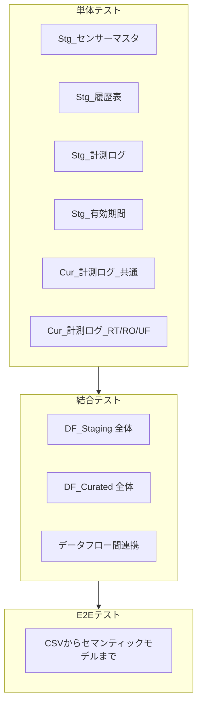
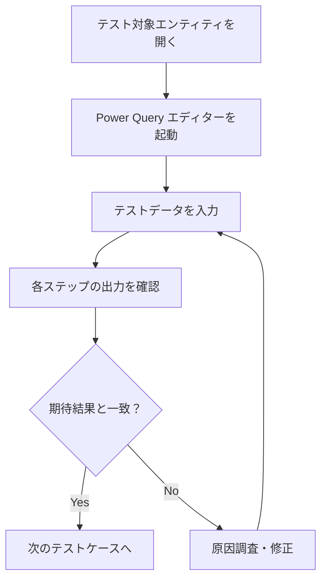
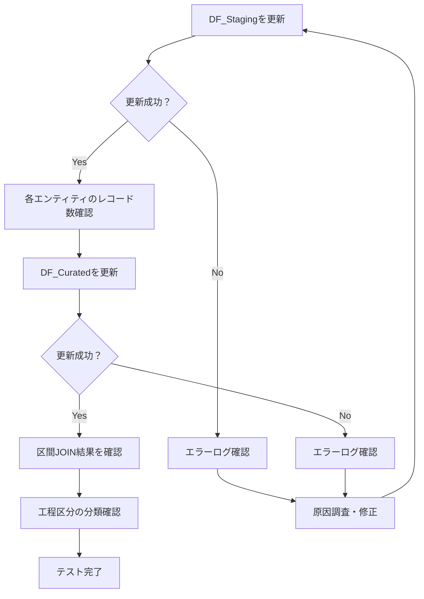
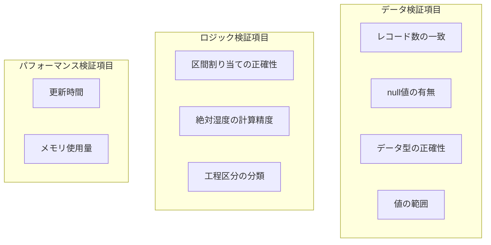
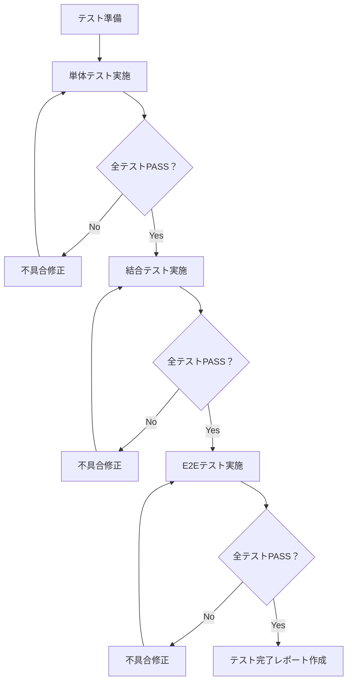

# テスト手順

> **ドキュメントバージョン**: 1.0
> **最終更新日**: 2025-12-11
> **前提ドキュメント**: [区間JOIN処理詳細](./04_interval_join_logic.md)

---

## 目次

1. [概要](#1-概要)
2. [テスト戦略](#2-テスト戦略)
3. [単体テスト](#3-単体テスト)
4. [結合テスト](#4-結合テスト)
5. [テストデータ](#5-テストデータ)
6. [テスト実施フロー](#6-テスト実施フロー)
7. [期待結果の確認方法](#7-期待結果の確認方法)
8. [関連ドキュメント](#8-関連ドキュメント)

---

## 1. 概要

本ドキュメントでは、データフロー実装のテスト手順を説明します。

### テストの目的

| 目的 | 説明 |
|------|------|
| 機能検証 | 各エンティティが仕様通り動作することを確認 |
| データ品質 | 出力データの正確性・完全性を検証 |
| パフォーマンス | 処理時間が許容範囲内であることを確認 |

---

## 2. テスト戦略

### 2.1 テストレベル



### 2.2 テストカバレッジ

| カテゴリ | テスト項目数 | 優先度 |
|----------|--------------|--------|
| 型変換 | 8 | 高 |
| 区間JOIN | 6 | 高 |
| 計算ロジック | 4 | 高 |
| 境界条件 | 5 | 中 |
| エラー処理 | 4 | 中 |

---

## 3. 単体テスト

### 3.1 テストケース一覧

#### Stg_センサーマスタ

| ID | テストケース | 入力 | 期待結果 |
|----|--------------|------|----------|
| SM-01 | 正常データ読み込み | 標準CSVファイル | 全レコードが正しく読み込まれる |
| SM-02 | 型変換（センサナンバー） | "40" | Int64: 40 |
| SM-03 | 空行の除外 | 空行を含むCSV | 空行が除外される |
| SM-04 | 重複排除 | 同一センサナンバー | 最初のレコードのみ残る |

#### Stg_履歴表

| ID | テストケース | 入力 | 期待結果 |
|----|--------------|------|----------|
| RH-01 | 日時パース（標準形式） | "2025/10/23 18:10" | 2025-10-23T18:10:00+09:00 |
| RH-02 | 日時パース（1桁月日） | "2025/9/5 8:05" | 2025-09-05T08:05:00+09:00 |
| RH-03 | ソート確認 | 複数センサー | センサナンバー→日時の順にソート |
| RH-04 | 日本語保管場所 | "エリアA" | 正しく読み込まれる |

#### Stg_計測ログ

| ID | テストケース | 入力 | 期待結果 |
|----|--------------|------|----------|
| ML-01 | ISO 8601日時パース | "2025-10-11T10:20:22+09:00" | 正しくパース |
| ML-02 | 複数ファイル統合 | 3ファイル | 全レコードが統合される |
| ML-03 | 温度型変換 | "24.621" | number: 24.621 |
| ML-04 | 列名正規化 | "field1(Temperature ºC )" | "Temperature" |

#### Cur_計測ログ_共通

| ID | テストケース | 入力 | 期待結果 |
|----|--------------|------|----------|
| CC-01 | センサナンバー変換 | serial: Y1044N2VT5C | センサナンバー: 40 |
| CC-02 | 区間JOIN（通常） | 計測時刻が区間内 | 正しい保管場所が割り当て |
| CC-03 | 区間JOIN（境界） | 計測時刻 = 区間開始 | その区間に含まれる |
| CC-04 | 絶対湿度計算 | T=25, RH=50 | AH ≈ 11.5 g/m³ |

### 3.2 単体テスト実施手順



---

## 4. 結合テスト

### 4.1 テストケース一覧

#### DF_Staging 結合テスト

| ID | テストケース | 確認項目 |
|----|--------------|----------|
| IS-01 | データフロー更新成功 | エラーなく更新完了 |
| IS-02 | 全エンティティ生成 | 4エンティティが生成される |
| IS-03 | レコード数の整合性 | 入力CSVの行数と一致 |

#### DF_Curated 結合テスト

| ID | テストケース | 確認項目 |
|----|--------------|----------|
| IC-01 | Staging層参照成功 | リンクエンティティが正しく参照 |
| IC-02 | 区間JOINの完全性 | 全計測レコードに保管場所が割り当て |
| IC-03 | 工程区分の分割 | RT/RO/UFが正しく分類される |

#### データフロー間連携テスト

| ID | テストケース | 確認項目 |
|----|--------------|----------|
| IL-01 | 更新順序の確認 | Staging→Curatedの順で更新 |
| IL-02 | データ伝播の確認 | Stagingの変更がCuratedに反映 |

### 4.2 結合テスト実施手順



---

## 5. テストデータ

### 5.1 テストデータファイル

プロジェクトの `data/` ディレクトリにあるファイルをテストデータとして使用します。

| ファイル | 説明 | レコード数 |
|----------|------|------------|
| センサーマスタ.csv | センサー情報 | 7件 |
| 履歴表.csv | 保管場所履歴 | 22件 |
| 計測ログ_X0073B9LA2F.csv | センサー41の計測ログ | 6件 |
| 計測ログ_Y1044N2VT5C.csv | センサー40の計測ログ | 6件 |
| 計測ログ_X8158B4WS1A.csv | センサー42の計測ログ | 6件 |

### 5.2 テストシナリオ別データ

#### シナリオ1: 標準的な区間JOIN

**履歴表データ**:
```csv
センサナンバー,LOT,保管場所,日時
40,Q25X231100,エリアA,2025/10/23 18:10
40,Q25X231100,エリアC,2025/10/23 19:25
40,Q25X231100,エリアB,2025/10/23 19:40
```

**計測ログデータ**:
```csv
created_at,Temperature,Humidity,serial
2025-10-23T18:15:00+09:00,24.5,45.0,Y1044N2VT5C
2025-10-23T19:30:00+09:00,23.8,48.2,Y1044N2VT5C
```

**期待結果**:
| created_at | 保管場所 | 理由 |
|------------|----------|------|
| 18:15 | エリアA | 18:10～19:25の区間内 |
| 19:30 | エリアC | 19:25～19:40の区間内 |

#### シナリオ2: 境界条件テスト

**計測ログデータ**:
```csv
created_at,Temperature,Humidity,serial
2025-10-23T18:10:00+09:00,24.5,45.0,Y1044N2VT5C
2025-10-23T19:25:00+09:00,23.8,48.2,Y1044N2VT5C
```

**期待結果**:
| created_at | 保管場所 | 理由 |
|------------|----------|------|
| 18:10 | エリアA | 区間開始と同時刻（含む） |
| 19:25 | エリアC | 次区間の開始（新区間に含む） |

### 5.3 検証ポイント



---

## 6. テスト実施フロー

### 6.1 全体フロー



### 6.2 テストチェックリスト

#### 単体テストチェックリスト

| # | テスト項目 | 実施日 | 結果 | 担当者 |
|---|------------|--------|------|--------|
| 1 | SM-01～SM-04 | | ☐PASS / ☐FAIL | |
| 2 | RH-01～RH-04 | | ☐PASS / ☐FAIL | |
| 3 | ML-01～ML-04 | | ☐PASS / ☐FAIL | |
| 4 | CC-01～CC-04 | | ☐PASS / ☐FAIL | |

#### 結合テストチェックリスト

| # | テスト項目 | 実施日 | 結果 | 担当者 |
|---|------------|--------|------|--------|
| 1 | IS-01～IS-03 | | ☐PASS / ☐FAIL | |
| 2 | IC-01～IC-03 | | ☐PASS / ☐FAIL | |
| 3 | IL-01～IL-02 | | ☐PASS / ☐FAIL | |

---

## 7. 期待結果の確認方法

### 7.1 Power Query エディターでの確認

1. 対象エンティティを選択
2. 右クリック → 「編集」
3. 各ステップをクリックして中間結果を確認
4. 最終出力でレコード数とデータ内容を確認

### 7.2 確認用クエリ

#### レコード数確認

```powerquery
let
    Source = Cur_計測ログ_共通,
    RowCount = Table.RowCount(Source)
in
    RowCount
```

#### null値確認

```powerquery
let
    Source = Cur_計測ログ_共通,
    NullRows = Table.SelectRows(
        Source,
        each [保管場所] = null or [LOT] = null
    ),
    NullCount = Table.RowCount(NullRows)
in
    NullCount
```

#### 絶対湿度検算

```powerquery
let
    // テスト値: T=25℃, RH=50%
    T = 25,
    RH = 50,
    Es = 6.112 * Number.Exp((17.67 * T) / (T + 243.5)),
    AH = (RH / 100) * Es * 2.1674 / (273.15 + T),
    // 期待値: 約11.5 g/m³
    Expected = 11.5,
    Tolerance = 0.5,
    IsValid = Number.Abs(AH - Expected) < Tolerance
in
    [Calculated = AH, Expected = Expected, IsValid = IsValid]
```

### 7.3 工程区分別レコード数確認

```powerquery
let
    RT = Table.RowCount(Cur_計測ログ_RT),
    RO = Table.RowCount(Cur_計測ログ_RO),
    UF = Table.RowCount(Cur_計測ログ_UF),
    Total = RT + RO + UF
in
    [RT = RT, RO = RO, UF = UF, Total = Total]
```

---

## 8. 関連ドキュメント

| ドキュメント | 説明 | リンク |
|--------------|------|--------|
| 全体概要 | プロジェクト概要 | [00_overview.md](./00_overview.md) |
| 区間JOIN処理詳細 | テスト対象のロジック | [04_interval_join_logic.md](./04_interval_join_logic.md) |
| トラブルシューティング | テスト中の問題対処 | [06_troubleshooting.md](./06_troubleshooting.md) |
| 用語集 | テスト用語の定義 | [07_reference.md](./07_reference.md) |

---

**前のステップ**: [区間JOIN処理詳細](./04_interval_join_logic.md)
**次のステップ**: [トラブルシューティング](./06_troubleshooting.md)
