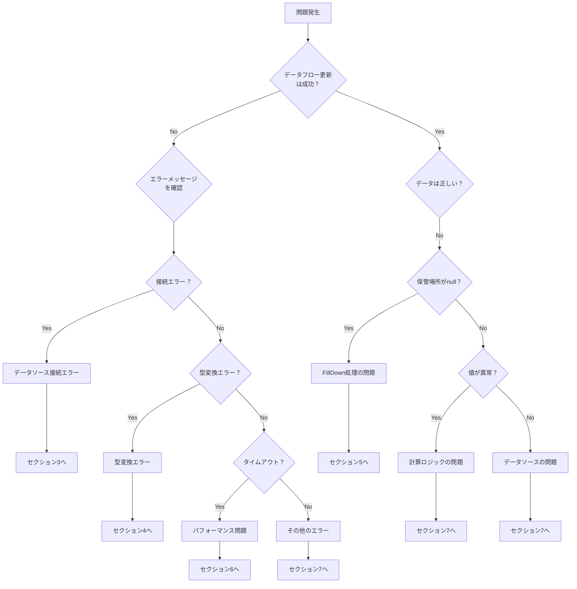
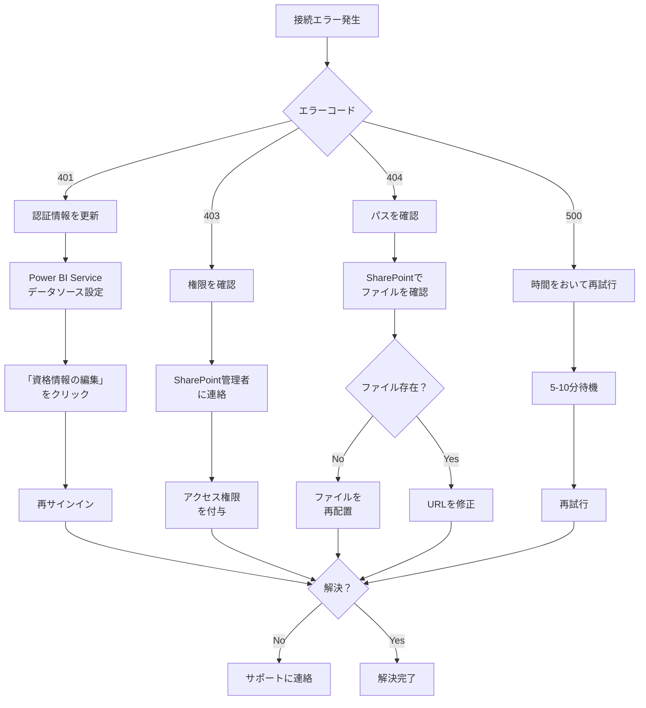
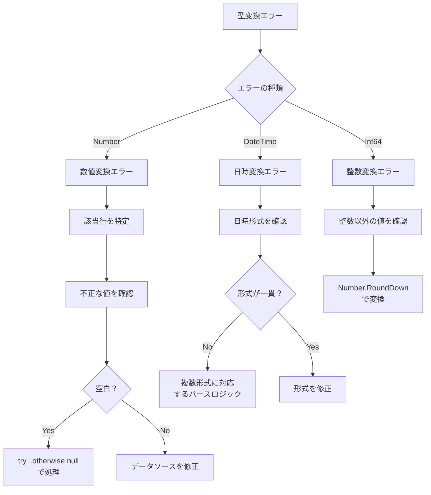
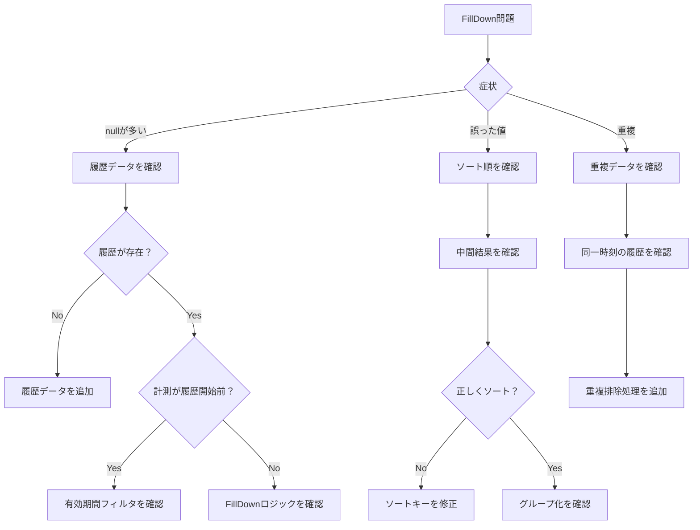
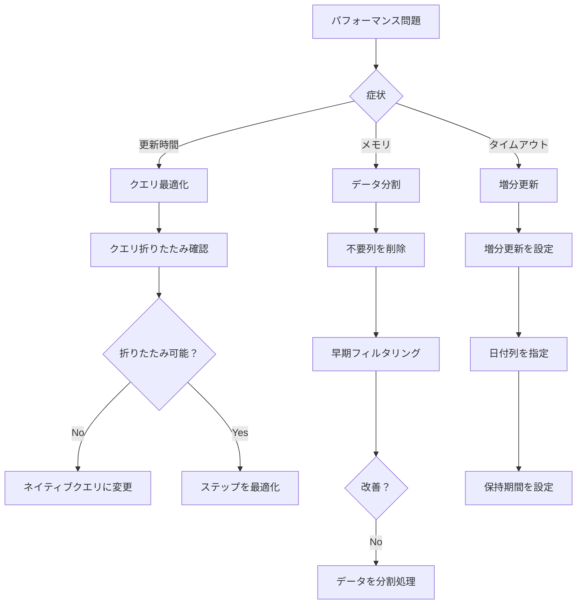

# トラブルシューティング

> **ドキュメントバージョン**: 1.0
> **最終更新日**: 2025-12-11
> **前提ドキュメント**: [テスト手順](./05_testing_procedure.md)

---

## 目次

1. [概要](#1-概要)
2. [問題判別フロー](#2-問題判別フロー)
3. [データソース接続エラー](#3-データソース接続エラー)
4. [型変換エラー](#4-型変換エラー)
5. [FillDown処理の問題](#5-filldown処理の問題)
6. [パフォーマンス問題](#6-パフォーマンス問題)
7. [その他の問題](#7-その他の問題)
8. [関連ドキュメント](#8-関連ドキュメント)

---

## 1. 概要

本ドキュメントでは、データフロー実装時に発生する可能性のある問題とその対処法を説明します。

### 問題カテゴリ

| カテゴリ | 概要 | 深刻度 |
|----------|------|--------|
| データソース接続 | SharePointへの接続失敗 | 高 |
| 型変換 | データ型の変換失敗 | 中～高 |
| FillDown処理 | 区間JOINの誤動作 | 高 |
| パフォーマンス | 処理時間・リソース | 中 |

---

## 2. 問題判別フロー

### 2.1 全体デシジョンツリー



---

## 3. データソース接続エラー

### 3.1 エラー一覧

| エラーコード | エラーメッセージ | 原因 |
|--------------|------------------|------|
| 401 | Unauthorized | 認証情報の期限切れまたは無効 |
| 403 | Forbidden | アクセス権限なし |
| 404 | Not Found | ファイルまたはフォルダーが存在しない |
| 500 | Internal Server Error | SharePointサーバーの問題 |

### 3.2 対処フロー



### 3.3 認証情報の更新手順

1. Power BI Serviceにログイン
2. 対象データフローの設定を開く
3. 「データソースの資格情報」セクションを展開
4. 「資格情報の編集」をクリック
5. 「組織アカウント」を選択して再サインイン
6. 「保存」をクリック

### 3.4 よくある原因と対策

| 原因 | 対策 |
|------|------|
| トークンの有効期限切れ | 定期的に資格情報を更新 |
| SharePointサイトの移行 | URLを新しいサイトに変更 |
| ファイル名の変更 | Power Queryのファイル名フィルターを更新 |
| フォルダー構造の変更 | パス設定を更新 |

---

## 4. 型変換エラー

### 4.1 エラー一覧

| エラーメッセージ | 原因 | 影響を受けるエンティティ |
|------------------|------|--------------------------|
| "Cannot convert value to type Number" | 数値以外の文字が含まれる | Stg_計測ログ |
| "Cannot convert value to type DateTime" | 日時形式が不正 | Stg_履歴表 |
| "Cannot convert value to type Int64" | 整数以外の値 | Stg_センサーマスタ |

### 4.2 対処フロー



### 4.3 エラーハンドリングの実装例

#### 数値変換のエラーハンドリング

```powerquery
// 安全な数値変換
SafeNumber = (value as any) as nullable number =>
    try Number.From(value) otherwise null,

// テーブルに適用
TransformedTable = Table.TransformColumns(
    Source,
    {
        {"Temperature", SafeNumber, type nullable number},
        {"Humidity", SafeNumber, type nullable number}
    }
)
```

#### 日時変換のエラーハンドリング

```powerquery
// 複数形式に対応した日時パース
ParseDateTime = (value as any) as nullable datetimezone =>
    let
        // 形式1: "2025/10/23 18:10"
        Try1 = try DateTime.FromText(value, [Format = "yyyy/M/d H:mm"]),
        // 形式2: "2025-10-23T18:10:00"
        Try2 = try DateTime.FromText(value, [Format = "yyyy-MM-ddTHH:mm:ss"]),
        // 形式3: ISO 8601
        Try3 = try DateTimeZone.FromText(value),

        Result = if not Try1[HasError] then
            DateTimeZone.FromText(
                DateTime.ToText(Try1[Value], "yyyy-MM-ddTHH:mm:ss") & "+09:00"
            )
        else if not Try2[HasError] then
            DateTimeZone.FromText(
                DateTime.ToText(Try2[Value], "yyyy-MM-ddTHH:mm:ss") & "+09:00"
            )
        else if not Try3[HasError] then
            Try3[Value]
        else
            null
    in
        Result
```

### 4.4 データ品質の確認クエリ

```powerquery
// 型変換エラーを含む行を特定
let
    Source = Stg_計測ログ,
    ErrorRows = Table.SelectRowsWithErrors(Source),
    ErrorCount = Table.RowCount(ErrorRows)
in
    [ErrorRows = ErrorRows, ErrorCount = ErrorCount]
```

---

## 5. FillDown処理の問題

### 5.1 症状一覧

| 症状 | 原因 | 影響 |
|------|------|------|
| 保管場所がnull | 履歴開始前の計測 | 区間割り当て失敗 |
| 誤った保管場所 | ソート順の誤り | 不正なデータ |
| 保管場所が重複 | 同一時刻の履歴 | データ品質低下 |

### 5.2 対処フロー



### 5.3 デバッグ手順

#### Step 1: 中間結果の確認

```powerquery
// FillDown前のデータを確認
let
    Source = CombinedTable,
    Sorted = Table.Sort(Source, {
        {"センサナンバー", Order.Ascending},
        {"日時", Order.Ascending}
    }),
    // 特定のセンサナンバーでフィルター
    Filtered = Table.SelectRows(Sorted, each [センサナンバー] = 40)
in
    Filtered
```

#### Step 2: FillDown結果の確認

```powerquery
// FillDown後のデータを確認
let
    Source = FillDownApplied,
    // null値を含む行を確認
    NullRows = Table.SelectRows(Source, each [保管場所] = null),
    NullCount = Table.RowCount(NullRows)
in
    [NullRows = NullRows, NullCount = NullCount]
```

### 5.4 よくある問題と対策

| 問題 | 対策 |
|------|------|
| センサナンバー間でFillDownが跨ぐ | グループ化してからFillDown |
| 履歴開始前のレコードにnull | 有効期間フィルタで除外 |
| 同一時刻の履歴で誤った順序 | EventTypeでの追加ソート |

---

## 6. パフォーマンス問題

### 6.1 症状一覧

| 症状 | 閾値 | 原因候補 |
|------|------|----------|
| 更新時間が長い | > 30分 | データ量、非効率なクエリ |
| メモリエラー | - | 大量データのメモリ展開 |
| タイムアウト | 2時間 | 複雑なクエリ、データ量 |

### 6.2 対処フロー



### 6.3 最適化テクニック

#### クエリ折りたたみの確認

Power Query エディターで各ステップを右クリックし、「ネイティブクエリの表示」が有効かどうかを確認します。

#### 不要列の早期削除

```powerquery
// 良い例：必要な列のみを早期に選択
let
    Source = SharePoint.Files(...),
    SelectedColumns = Table.SelectColumns(Source, {"Content", "Name"}),
    // 以降の処理
    ...
```

#### 早期フィルタリング

```powerquery
// 良い例：データソースレベルでフィルター
let
    Source = SharePoint.Files(...),
    // 早期にファイルをフィルター
    FilteredFiles = Table.SelectRows(Source, each [Name] = "target.csv"),
    // 以降の処理
    ...
```

### 6.4 増分更新の設定

```powerquery
// 増分更新用のパラメータ（Power BI Serviceで自動生成）
RangeStart = #datetime(2025, 1, 1, 0, 0, 0) meta [IsParameterQuery=true],
RangeEnd = #datetime(2025, 12, 31, 23, 59, 59) meta [IsParameterQuery=true],

// クエリでの使用
FilteredByDate = Table.SelectRows(
    Source,
    each [created_at] >= RangeStart and [created_at] < RangeEnd
)
```

---

## 7. その他の問題

### 7.1 データフロー更新の競合

| 問題 | 原因 | 対策 |
|------|------|------|
| 同時更新エラー | 複数の更新が同時に実行 | 更新スケジュールをずらす |
| 依存関係エラー | Staging未完了でCurated更新 | 更新順序を設定 |

### 7.2 文字化け

| 問題 | 原因 | 対策 |
|------|------|------|
| 日本語が文字化け | エンコーディング不一致 | UTF-8 BOM（65001）を指定 |
| 特殊文字の欠落 | クォート処理の問題 | QuoteStyleを適切に設定 |

```powerquery
// 正しいエンコーディング設定
Csv.Document(
    Content,
    [
        Delimiter = ",",
        Encoding = 65001,  // UTF-8
        QuoteStyle = QuoteStyle.Csv
    ]
)
```

### 7.3 計算結果の不整合

| 問題 | 原因 | 対策 |
|------|------|------|
| 絶対湿度が異常 | 入力値の単位誤り | 単位を確認 |
| 小数点以下の誤差 | 浮動小数点演算 | 許容誤差を設定 |

---

## 8. 関連ドキュメント

| ドキュメント | 説明 | リンク |
|--------------|------|--------|
| 全体概要 | プロジェクト概要 | [00_overview.md](./00_overview.md) |
| テスト手順 | 問題の検出方法 | [05_testing_procedure.md](./05_testing_procedure.md) |
| 用語集 | エラー用語の定義 | [07_reference.md](./07_reference.md) |

---

**前のステップ**: [テスト手順](./05_testing_procedure.md)
**次のステップ**: [用語集・リファレンス](./07_reference.md)
