# 全工程熱履歴分析実装ガイド：データモデル構築手順書

## 目次

1. [ドキュメント概要](#ドキュメント概要)
2. [前提条件](#前提条件)
3. [全体データフロー図](#全体データフロー図)
4. [実装手順フローチャート](#実装手順フローチャート)
5. [データモデル設計](#データモデル設計)
6. [実装手順](#実装手順)
7. [集計可能ロット数の表示方法](#集計可能ロット数の表示方法)

---

## ドキュメント概要

### 対象範囲

本ドキュメントは、全工程熱履歴分析システムにおけるデータモデルの構築から集計可能ロット数の表示までの実装手順を詳細に記載した作業手順書である。具体的には、計測ログテーブルへの時間関連列の追加、時間窓マスタテーブルの作成、6つの計算テーブルの構築、リレーションシップの設定、および集計可能ロット数を可視化するためのDAXメジャーとビジュアルの作成までを対象とする。

### 想定読者

本ドキュメントは、Power Queryの基本的な操作知識を持つ担当者が、ドキュメントのみで作業を完遂できることを目的として作成されている。また、別担当者への引き継ぎ資料としても使用可能な構成となっている。

### 実装により達成される分析

実装完了後、以下の分析が可能となる。UF品の生産直後および使用直前の熱履歴がRO品性能に与える影響の検証、RO品の生産直後および使用直前の熱履歴がRT品性能に与える影響の検証、RT品の生産直後および使用直前の熱履歴が最終製品性能に与える影響の検証、RO品の生産直後および使用直前の熱履歴が最終製品性能に与える影響の検証（RTスキップケース）が実現される。

時間窓の長さ（6時間、12時間、24時間、48時間）と相関強度の関係を定量的に評価することで、初期条件依存性の仮説を検証できる。また、各時間窓において統計値算出に使用されたロット数（n数）を表示することで、分析結果の統計的妥当性を評価できる。

---

## 前提条件

### システム環境

本作業を開始する前に、以下のシステム環境が整っていることを確認する必要がある。Power BI DesktopまたはPower Platform Dataflowsの環境が利用可能であり、Premium Per Userライセンスまたは相当のライセンスが有効化されている必要がある。Power Queryエディターへのアクセス権限が付与されており、データフローの編集が可能である必要がある。

### 既存データ構造

以下のテーブルおよびデータ構造が既に存在していることが前提条件となる。

Cur_計測ログ_UFテーブルには、created_at列（DateTime型）、serial列（テキスト型）、Temperature列（数値型）、Humidity列（数値型）、センサナンバー列（テキスト型）、LOT列（テキスト型）、保管場所列（テキスト型）、絶対湿度列（数値型）が含まれている必要がある。

Cur_計測ログ_ROテーブルには、Cur_計測ログ_UFと同様の列構造が含まれている必要がある。

Cur_計測ログ_RTテーブルには、Cur_計測ログ_UFと同様の列構造が含まれている必要がある。

Link_履歴表テーブルには、センサナンバー列（テキスト型）、LOT列（テキスト型）、日時列（DateTime型）、ステータス列（整数型：0、1、2のいずれか）、保管場所列（テキスト型）が含まれている必要がある。

Cur_ロット系譜テーブルには、製品ロット列（テキスト型）、RTロット列（テキスト型）、ROロット列（テキスト型）、UFロット列（テキスト型）、性能F列（数値型）、性能R列（数値型）、RT性能F列（数値型）、RT性能R列（数値型）、RO性能F列（数値型）、RO性能R列（数値型）が含まれている必要がある。

### 完了済みの前処理

以下の前処理が完了していることを確認する。計測ログテーブルの保管場所割当処理（FillDown処理）が完了していること、工程区分列と絶対湿度列が追加されていること、工程別にテーブルが分割されていること（Cur_計測ログ_UF、Cur_計測ログ_RO、Cur_計測ログ_RT）が確認されている必要がある。

異常ロット検出・除外ロジックが実装されており、Link_履歴表には正常ロット（ステータス2が存在するロット）のみが含まれていることを確認する。

---

## 全体データフロー図

実装完了後のデータモデル全体のデータフロー図を以下に示す。この図は、各テーブル間のリレーションシップとデータの流れを表現している。

```mermaid
flowchart TB
    subgraph 入力層["入力層：既存テーブル"]
        HIST[Link_履歴表<br/>センサナンバー・LOT・日時・ステータス・保管場所]
        LOG_UF[Cur_計測ログ_UF<br/>既存版]
        LOG_RO[Cur_計測ログ_RO<br/>既存版]
        LOG_RT[Cur_計測ログ_RT<br/>既存版]
        GENE[Cur_ロット系譜<br/>製品・RT・RO・UFロット<br/>各種性能指標]
    end
    
    subgraph 第1段階["第1段階：計測ログへの列追加"]
        HIST -->|ステータス0抽出| START0[保管開始時刻<br/>テーブル]
        HIST -->|ステータス2抽出| END2[保管終了時刻<br/>テーブル]
        
        LOG_UF -->|LEFT JOIN| ENH_UF[Cur_計測ログ_UF<br/>拡張版<br/>+保管開始時刻<br/>+経過時間_時間<br/>+保管終了時刻<br/>+終了前経過時間_時間]
        START0 -->|結合| ENH_UF
        END2 -->|結合| ENH_UF
        
        LOG_RO -->|LEFT JOIN| ENH_RO[Cur_計測ログ_RO<br/>拡張版<br/>+4列]
        START0 -->|結合| ENH_RO
        END2 -->|結合| ENH_RO
        
        LOG_RT -->|LEFT JOIN| ENH_RT[Cur_計測ログ_RT<br/>拡張版<br/>+4列]
        START0 -->|結合| ENH_RT
        END2 -->|結合| ENH_RT
    end
    
    subgraph 第2段階["第2段階：時間窓マスタ"]
        TW[Dim_時間窓マスタ<br/>時間窓ID: 1-8<br/>生産直後: 1-4<br/>使用直前: 5-8<br/>時間窓タイプ列]
    end
    
    subgraph 第3段階["第3段階：計算テーブル作成"]
        CALC_UF_S[Calc_UF保管統計<br/>_生産直後<br/>UFロット×時間窓ID<br/>平均温度・湿度]
        CALC_UF_E[Calc_UF保管統計<br/>_使用直前<br/>UFロット×時間窓ID<br/>平均温度・湿度]
        
        CALC_RO_S[Calc_RO保管統計<br/>_生産直後<br/>ROロット×時間窓ID<br/>平均温度・湿度]
        CALC_RO_E[Calc_RO保管統計<br/>_使用直前<br/>ROロット×時間窓ID<br/>平均温度・湿度]
        
        CALC_RT_S[Calc_RT保管統計<br/>_生産直後<br/>RTロット×時間窓ID<br/>平均温度・湿度]
        CALC_RT_E[Calc_RT保管統計<br/>_使用直前<br/>RTロット×時間窓ID<br/>平均温度・湿度]
        
        GENE -.ROロット一覧抽出.-> CALC_UF_S
        GENE -.ROロット一覧抽出.-> CALC_UF_E
        GENE -.RTロット一覧抽出.-> CALC_RO_S
        GENE -.RTロット一覧抽出.-> CALC_RO_E
        GENE -.製品ロット一覧抽出.-> CALC_RT_S
        GENE -.製品ロット一覧抽出.-> CALC_RT_E
        
        TW -.時間窓定義.-> CALC_UF_S
        TW -.時間窓定義.-> CALC_UF_E
        TW -.時間窓定義.-> CALC_RO_S
        TW -.時間窓定義.-> CALC_RO_E
        TW -.時間窓定義.-> CALC_RT_S
        TW -.時間窓定義.-> CALC_RT_E
        
        ENH_UF -.計測データ参照.-> CALC_UF_S
        ENH_UF -.計測データ参照.-> CALC_UF_E
        ENH_RO -.計測データ参照.-> CALC_RO_S
        ENH_RO -.計測データ参照.-> CALC_RO_E
        ENH_RT -.計測データ参照.-> CALC_RT_S
        ENH_RT -.計測データ参照.-> CALC_RT_E
    end
    
    subgraph 第4段階["第4段階：リレーションシップ"]
        TW -->|時間窓ID<br/>1:多| CALC_UF_S
        TW -->|時間窓ID<br/>1:多| CALC_UF_E
        TW -->|時間窓ID<br/>1:多| CALC_RO_S
        TW -->|時間窓ID<br/>1:多| CALC_RO_E
        TW -->|時間窓ID<br/>1:多| CALC_RT_S
        TW -->|時間窓ID<br/>1:多| CALC_RT_E
        
        CALC_UF_S <-->|UFロット<br/>多:多・双方向| GENE
        CALC_UF_E <-->|UFロット<br/>多:多・双方向| GENE
        CALC_RO_S <-->|ROロット<br/>多:多・双方向| GENE
        CALC_RO_E <-->|ROロット<br/>多:多・双方向| GENE
        CALC_RT_S <-->|RTロット<br/>多:多・双方向| GENE
        CALC_RT_E <-->|RTロット<br/>多:多・双方向| GENE
    end
    
    subgraph 分析層["分析層：ビジュアル"]
        SLICER[時間窓スライサー<br/>Dim_時間窓マスタ]
        SCATTER[散布図<br/>X: 平均温度<br/>Y: 性能指標<br/>凡例: 時間窓名]
        R2[決定係数R²<br/>時間窓別比較]
        COUNT[集計可能ロット数n数<br/>カード表示]
        
        TW --> SLICER
        CALC_UF_S --> SCATTER
        CALC_UF_S --> R2
        CALC_UF_S --> COUNT
        GENE --> SCATTER
        GENE --> R2
    end
    
    style ENH_UF fill:#e1f5ff
    style ENH_RO fill:#e1f5ff
    style ENH_RT fill:#e1f5ff
    style TW fill:#ffe1f0
    style CALC_UF_S fill:#f0ffe1
    style CALC_UF_E fill:#f0ffe1
    style CALC_RO_S fill:#f0ffe1
    style CALC_RO_E fill:#f0ffe1
    style CALC_RT_S fill:#f0ffe1
    style CALC_RT_E fill:#f0ffe1
    style GENE fill:#fff4e1
    style SCATTER fill:#e1ffe1
```



---

## 実装手順フローチャート

作業の全体的な流れを以下のフローチャートに示す。この図は、実装作業のステップとその順序を表現している。

```mermaid
flowchart TD
    START([作業開始]) --> CHECK1{前提条件の確認<br/>既存テーブル構造OK?}
    CHECK1 -->|No| FIX1[前提条件を満たす<br/>前処理を実施]
    FIX1 --> CHECK1
    CHECK1 -->|Yes| STEP1[第1段階開始]
    
    STEP1 --> STEP1A[履歴表からステータス0抽出<br/>保管開始時刻テーブル作成]
    STEP1A --> STEP1B[履歴表からステータス2抽出<br/>保管終了時刻テーブル作成]
    STEP1B --> STEP1C[Cur_計測ログ_UFに<br/>4列追加<br/>LEFT JOIN & 時間計算]
    STEP1C --> STEP1D[Cur_計測ログ_ROに<br/>4列追加]
    STEP1D --> STEP1E[Cur_計測ログ_RTに<br/>4列追加]
    STEP1E --> VERIFY1{第1段階確認<br/>4列追加OK?<br/>時間計算正常?}
    VERIFY1 -->|No| STEP1
    VERIFY1 -->|Yes| STEP2[第2段階開始]
    
    STEP2 --> STEP2A[Dim_時間窓マスタ<br/>DAX作成<br/>8行データ定義]
    STEP2A --> VERIFY2{第2段階確認<br/>8行データOK?<br/>タイプ列存在?}
    VERIFY2 -->|No| STEP2
    VERIFY2 -->|Yes| STEP3[第3段階開始]
    
    STEP3 --> STEP3A[Calc_UF保管統計_生産直後<br/>DAX作成<br/>詳細手順]
    STEP3A --> STEP3B[Calc_UF保管統計_使用直前<br/>DAX作成<br/>同様手順]
    STEP3B --> STEP3C[Calc_RO保管統計_生産直後<br/>DAX作成]
    STEP3C --> STEP3D[Calc_RO保管統計_使用直前<br/>DAX作成]
    STEP3D --> STEP3E[Calc_RT保管統計_生産直後<br/>DAX作成]
    STEP3E --> STEP3F[Calc_RT保管統計_使用直前<br/>DAX作成]
    STEP3F --> VERIFY3{第3段階確認<br/>6テーブル作成OK?<br/>行数=ロット数×4?<br/>統計値計算正常?}
    VERIFY3 -->|No| STEP3
    VERIFY3 -->|Yes| STEP4[第4段階開始]
    
    STEP4 --> STEP4A[Dim_時間窓マスタ→<br/>各計算テーブル<br/>6本のリレーション作成<br/>1:多・単一方向]
    STEP4A --> STEP4B[各計算テーブル→<br/>Cur_ロット系譜<br/>6本のリレーション作成<br/>多:多・双方向]
    STEP4B --> VERIFY4{第4段階確認<br/>12本のリレーションOK?<br/>カーディナリティ正常?}
    VERIFY4 -->|No| STEP4
    VERIFY4 -->|Yes| STEP5[集計可能ロット数の<br/>表示設定開始]
    
    STEP5 --> STEP5A[集計可能ロット数<br/>DAXメジャー作成<br/>6工程×2タイプ]
    STEP5A --> STEP5B[全ロット数<br/>DAXメジャー作成]
    STEP5B --> STEP5C[集計率<br/>DAXメジャー作成]
    STEP5C --> STEP5D[カードビジュアル配置<br/>各分析ページ]
    STEP5D --> VERIFY5{集計可能ロット数<br/>表示確認<br/>時間窓連動OK?}
    VERIFY5 -->|No| STEP5
    VERIFY5 -->|Yes| COMPLETE([実装完了])
    
    style START fill:#90EE90
    style COMPLETE fill:#90EE90
    style CHECK1 fill:#FFE4B5
    style VERIFY1 fill:#FFE4B5
    style VERIFY2 fill:#FFE4B5
    style VERIFY3 fill:#FFE4B5
    style VERIFY4 fill:#FFE4B5
    style VERIFY5 fill:#FFE4B5
```



---

## データモデル設計

### 拡張されるテーブルの構造

本実装により、既存のテーブルに新規列が追加され、新規テーブルが作成される。以下に各テーブルの詳細構造を示す。

#### Cur_計測ログ_UF（拡張後）

既存のCur_計測ログ_UFテーブルに4つの新規列を追加する。拡張後のテーブル構造を以下に示す。

| 列名 | データ型 | 説明 | 追加/既存 |
|------|---------|------|----------|
| created_at | DateTime | 計測日時 | 既存 |
| serial | Text | センサーシリアル番号 | 既存 |
| Temperature | Number | 温度（℃） | 既存 |
| Humidity | Number | 相対湿度（％） | 既存 |
| センサナンバー | Text | センサー番号 | 既存 |
| LOT | Text | UFロット番号 | 既存 |
| 保管場所 | Text | 保管エリア名 | 既存 |
| 絶対湿度 | Number | 絶対湿度（g/m³） | 既存 |
| **保管開始時刻** | **DateTime** | **このロットの保管開始時刻（ステータス0の日時）** | **追加** |
| **経過時間_時間** | **Number** | **保管開始からの経過時間（時間単位）正の値** | **追加** |
| **保管終了時刻** | **DateTime** | **このロットの保管終了時刻（ステータス2の日時）** | **追加** |
| **終了前経過時間_時間** | **Number** | **保管終了までの残り時間（時間単位）負の値** | **追加** |

**データ例：**

| created_at | LOT | Temperature | 保管開始時刻 | 経過時間_時間 | 保管終了時刻 | 終了前経過時間_時間 |
|-----------|-----|-------------|-------------|--------------|-------------|-------------------|
| 2025-10-24 09:40 | Q25X240200 | 24.5 | 2025-10-24 09:40 | 0.0 | 2025-10-26 09:40 | -48.0 |
| 2025-10-24 10:40 | Q25X240200 | 25.1 | 2025-10-24 09:40 | 1.0 | 2025-10-26 09:40 | -47.0 |
| 2025-10-24 15:40 | Q25X240200 | 24.8 | 2025-10-24 09:40 | 6.0 | 2025-10-26 09:40 | -42.0 |
| 2025-10-26 08:40 | Q25X240200 | 24.2 | 2025-10-24 09:40 | 47.0 | 2025-10-26 09:40 | -1.0 |

Cur_計測ログ_ROとCur_計測ログ_RTにも同様の4列が追加される。

#### Dim_時間窓マスタ（新規作成）

時間窓の定義を格納するディメンションテーブルである。生産直後と使用直前の両方のタイプを含む統合テーブルとして設計する。

| 列名 | データ型 | 説明 |
|------|---------|------|
| 時間窓ID | Integer | 時間窓の識別子（主キー）1-8 |
| 時間窓名 | Text | 時間窓の表示名 |
| 開始時間_相対 | Integer | 保管開始または終了からの開始時間（時間単位） |
| 終了時間_相対 | Integer | 保管開始または終了からの終了時間（時間単位） |
| 表示順序 | Integer | ビジュアルでの並び順 1-8 |
| 時間窓タイプ | Text | 「生産直後」または「使用直前」 |

**データ例：**

| 時間窓ID | 時間窓名 | 開始時間_相対 | 終了時間_相対 | 表示順序 | 時間窓タイプ |
|---------|---------|--------------|-------------|---------|------------|
| 1 | 生産直後0-6hr | 0 | 6 | 1 | 生産直後 |
| 2 | 生産直後0-12hr | 0 | 12 | 2 | 生産直後 |
| 3 | 生産直後0-24hr | 0 | 24 | 3 | 生産直後 |
| 4 | 生産直後0-48hr | 0 | 48 | 4 | 生産直後 |
| 5 | 使用直前6-0hr | -6 | 0 | 5 | 使用直前 |
| 6 | 使用直前12-0hr | -12 | 0 | 6 | 使用直前 |
| 7 | 使用直前24-0hr | -24 | 0 | 7 | 使用直前 |
| 8 | 使用直前48-0hr | -48 | 0 | 8 | 使用直前 |

このテーブルは8行固定である。

#### 計算テーブル（6種類）

各計算テーブルは、ロットと時間窓の組み合わせごとに統計値を事前計算する。以下の6つのテーブルが作成される。

- Calc_UF保管統計_生産直後
- Calc_UF保管統計_使用直前
- Calc_RO保管統計_生産直後
- Calc_RO保管統計_使用直前
- Calc_RT保管統計_生産直後
- Calc_RT保管統計_使用直前

各テーブルの列構造は以下の通りである（Calc_UF保管統計_生産直後を例示）。

| 列名 | データ型 | 説明 |
|------|---------|------|
| UFロット | Text | UFロット番号 |
| 時間窓ID | Integer | Dim_時間窓マスタの時間窓ID |
| 時間窓名 | Text | 時間窓の表示名 |
| 開始時間_相対 | Integer | 時間窓の開始時間 |
| 終了時間_相対 | Integer | 時間窓の終了時間 |
| 平均温度 | Number | 時間窓内の平均温度（℃）、データなしの場合null |
| 平均湿度 | Number | 時間窓内の平均相対湿度（％）、データなしの場合null |
| 平均絶対湿度 | Number | 時間窓内の平均絶対湿度（g/m³）、データなしの場合null |

**データ例（Calc_UF保管統計_生産直後）：**

| UFロット | 時間窓ID | 時間窓名 | 開始時間_相対 | 終了時間_相対 | 平均温度 | 平均湿度 | 平均絶対湿度 |
|---------|---------|---------|--------------|-------------|---------|---------|-------------|
| Q25X240200 | 1 | 生産直後0-6hr | 0 | 6 | 24.8 | 45.0 | 10.3 |
| Q25X240200 | 2 | 生産直後0-12hr | 0 | 12 | 24.6 | 45.1 | 10.2 |
| Q25X240200 | 3 | 生産直後0-24hr | 0 | 24 | 24.5 | 45.3 | 10.1 |
| Q25X240200 | 4 | 生産直後0-48hr | 0 | 48 | 24.3 | 45.5 | 10.0 |
| Q25X240300 | 1 | 生産直後0-6hr | 0 | 6 | 25.2 | 44.5 | 10.6 |
| Q25X240300 | 2 | 生産直後0-12hr | 0 | 12 | 25.0 | 44.7 | 10.5 |
| Q25X240300 | 3 | 生産直後0-24hr | 0 | 24 | 24.9 | 44.8 | 10.4 |
| Q25X240300 | 4 | 生産直後0-48hr | 0 | 48 | null | null | null |

この例において、UFロット「Q25X240300」は保管期間が30時間しかなかったため、生産直後0-48hrの時間窓では計測データが存在せず、平均温度、平均湿度、平均絶対湿度がすべてnullとなっている。

各テーブルの行数は、対象ロット数×4（時間窓数）となる。例えば、UFロットが50個存在する場合、Calc_UF保管統計_生産直後は200行（50×4）となる。ただし、すべての行で統計値が計算されるわけではなく、保管期間が短いロットでは長い時間窓の統計値がnullとなる。

### リレーションシップ設計

実装により構築されるリレーションシップの詳細を以下に示す。

#### リレーションシップグループ1：Dim_時間窓マスタ→各計算テーブル

Dim_時間窓マスタから6つの計算テーブルへのリレーションシップを構築する。すべてのリレーションシップで以下の設定を使用する。

**接続元テーブル：** Dim_時間窓マスタ
**接続元列：** 時間窓ID
**接続先テーブル：** 各計算テーブル
**接続先列：** 時間窓ID
**カーディナリティ：** 一対多（1:*）
**クロスフィルタ方向：** 単一（Single）

このリレーションシップにより、時間窓スライサーで特定の時間窓を選択すると、すべての計算テーブルが同時にフィルタリングされる。

#### リレーションシップグループ2：各計算テーブル→Cur_ロット系譜

6つの計算テーブルとCur_ロット系譜の間にリレーションシップを構築する。各リレーションシップの詳細を以下に示す。

**Calc_UF保管統計_生産直後→Cur_ロット系譜：**
接続元列はUFロット、接続先列はUFロット、カーディナリティは多対多（*:*）、クロスフィルタ方向は双方向（Both）である。

**Calc_UF保管統計_使用直前→Cur_ロット系譜：**
接続元列はUFロット、接続先列はUFロット、カーディナリティは多対多（*:*）、クロスフィルタ方向は双方向（Both）である。

**Calc_RO保管統計_生産直後→Cur_ロット系譜：**
接続元列はROロット、接続先列はROロット、カーディナリティは多対多（*:*）、クロスフィルタ方向は双方向（Both）である。

**Calc_RO保管統計_使用直前→Cur_ロット系譜：**
接続元列はROロット、接続先列はROロット、カーディナリティは多対多（*:*）、クロスフィルタ方向は双方向（Both）である。

**Calc_RT保管統計_生産直後→Cur_ロット系譜：**
接続元列はRTロット、接続先列はRTロット、カーディナリティは多対多（*:*）、クロスフィルタ方向は双方向（Both）である。

**Calc_RT保管統計_使用直前→Cur_ロット系譜：**
接続元列はRTロット、接続先列はRTロット、カーディナリティは多対多（*:*）、クロスフィルタ方向は双方向（Both）である。

多対多となる理由は、計算テーブル側では同一ロットが時間窓の数だけ繰り返され、Cur_ロット系譜側では同一ロットが複数の製品で使用されるためである。双方向フィルタリングにより、どちらの方向からもフィルタが適用される。

---

## 実装手順

### 第1段階：計測ログテーブルへの列追加

#### 作業の目的

計測ログテーブルに保管開始時刻、経過時間、保管終了時刻、終了前経過時間の4列を追加することで、生産直後時間窓と使用直前時間窓の両方の分析を可能にする。経過時間_時間列は保管開始からの時間を示し、生産直後時間窓のフィルタリングに使用される。終了前経過時間_時間列は保管終了までの残り時間を示し、使用直前時間窓のフィルタリングに使用される。

#### 処理概要

履歴表からステータス0（保管開始）の行を抽出して保管開始時刻を取得し、ステータス2（保管終了）の行を抽出して保管終了時刻を取得する。これらを計測ログテーブルとセンサナンバーおよびLOTをキーとして左外部結合する。結合後、created_atと保管開始時刻の差分を計算して経過時間_時間列を作成し、created_atと保管終了時刻の差分を計算して終了前経過時間_時間列を作成する。

この処理をCur_計測ログ_UF、Cur_計測ログ_RO、Cur_計測ログ_RTの3つのテーブルに対して実施する。以下ではCur_計測ログ_UFを例に詳細手順を説明する。

#### GUI操作手順（Cur_計測ログ_UF）

##### ステップ1-1：Power Queryエディターを開く

Power BI Desktopを起動し、対象のPBIXファイルを開く。リボンメニューの「ホーム」タブから「データの変換」ボタンをクリックする。Power Queryエディターが新しいウィンドウとして開く。

##### ステップ1-2：Cur_計測ログ_UFクエリを選択

Power Queryエディター左側のクエリペインから「Cur_計測ログ_UF」クエリを選択する。クエリをクリックすると、右側のプレビューペインにテーブルの内容が表示される。現在のテーブル構造（列名とデータ型）を確認する。

##### ステップ1-3：詳細エディターを開く

選択した状態で、リボンメニューの「ホーム」タブから「詳細エディター」ボタンをクリックする。詳細エディターウィンドウが開き、現在のMコードが表示される。

##### ステップ1-4：Mコードの追加

詳細エディターに表示されているコードの最後の`in`句の直前に、以下のMコードを追加する。既存の最終ステップ名（例：`型変更`や`列削除`など）を確認し、その後に新しいステップを追加する形となる。

```powerquery
    // 履歴表からステータス0（保管開始）を抽出
    履歴表全体 = Link_履歴表,
    保管開始のみ = Table.SelectRows(履歴表全体, each [ステータス] = 0),
    保管開始必要列 = Table.SelectColumns(保管開始のみ, {"センサナンバー", "LOT", "日時"}),
    保管開始リネーム = Table.RenameColumns(保管開始必要列, {{"日時", "保管開始時刻"}}),
    
    // 履歴表からステータス2（保管終了）を抽出
    保管終了のみ = Table.SelectRows(履歴表全体, each [ステータス] = 2),
    保管終了必要列 = Table.SelectColumns(保管終了のみ, {"センサナンバー", "LOT", "日時"}),
    保管終了リネーム = Table.RenameColumns(保管終了必要列, {{"日時", "保管終了時刻"}}),
    
    // 計測ログと保管開始時刻を結合
    開始時刻結合 = Table.NestedJoin(
        【既存の最終ステップ名】,
        {"センサナンバー", "LOT"},
        保管開始リネーム,
        {"センサナンバー", "LOT"},
        "保管開始テーブル",
        JoinKind.LeftOuter
    ),
    開始時刻展開 = Table.ExpandTableColumn(
        開始時刻結合,
        "保管開始テーブル",
        {"保管開始時刻"},
        {"保管開始時刻"}
    ),
    
    // 計測ログと保管終了時刻を結合
    終了時刻結合 = Table.NestedJoin(
        開始時刻展開,
        {"センサナンバー", "LOT"},
        保管終了リネーム,
        {"センサナンバー", "LOT"},
        "保管終了テーブル",
        JoinKind.LeftOuter
    ),
    終了時刻展開 = Table.ExpandTableColumn(
        終了時刻結合,
        "保管終了テーブル",
        {"保管終了時刻"},
        {"保管終了時刻"}
    ),
    
    // 経過時間を計算（保管開始からの時間）
    経過時間追加 = Table.AddColumn(
        終了時刻展開,
        "経過時間_時間",
        each Duration.TotalHours([created_at] - [保管開始時刻]),
        type number
    ),
    
    // 終了前経過時間を計算（保管終了までの残り時間、負の値）
    終了前経過時間追加 = Table.AddColumn(
        経過時間追加,
        "終了前経過時間_時間",
        each Duration.TotalHours([created_at] - [保管終了時刻]),
        type number
    )
```

上記のコードにおいて、【既存の最終ステップ名】の部分を実際の既存クエリの最終ステップ名に置き換える。例えば、既存の最終ステップが`型変更1`という名前であれば、`開始時刻結合 = Table.NestedJoin(型変更1, ...)`とする。

最後の`in`句を以下のように変更する。

```powerquery
in
    終了前経過時間追加
```

##### ステップ1-5：コードの確定

「完了」ボタンをクリックして詳細エディターを閉じる。構文エラーがある場合はエラーメッセージが表示されるため、コードを確認して修正する。エラーがなければ、プレビューペインに新しい列が追加されたテーブルが表示される。

##### ステップ1-6：他のテーブルへの適用

Cur_計測ログ_ROとCur_計測ログ_RTに対しても同様の処理を適用する。各クエリを選択し、詳細エディターを開き、上記と同じMコードを追加する。コード内のテーブル参照は変更不要であるが、既存の最終ステップ名は各クエリに応じて適切に置き換える。

##### ステップ1-7：変更の適用

すべてのクエリへのコード追加が完了したら、Power Queryエディターの「ホーム」タブから「閉じて適用」ボタンをクリックする。Power BI Desktopに戻り、データモデルが更新される。

#### 第1段階完了後の確認

Power Queryエディターで各テーブル（Cur_計測ログ_UF、Cur_計測ログ_RO、Cur_計測ログ_RT）のプレビューを確認し、以下の点を検証する。

**テーブル構造の確認：**

以下の4つの新規列が追加されていることを確認する。保管開始時刻列（DateTime型）、経過時間_時間列（Number型）、保管終了時刻列（DateTime型）、終了前経過時間_時間列（Number型）が存在する必要がある。

**データ値の確認：**

プレビューペインで任意の行を選択し、以下の条件を満たしていることを確認する。保管開始時刻が履歴表のステータス0の日時と一致していること、保管終了時刻が履歴表のステータス2の日時と一致していること、経過時間_時間が正の値であり、created_atが保管開始時刻より後の場合に正しく計算されていること、終了前経過時間_時間が負の値であり、created_atが保管終了時刻より前の場合に負の値として正しく計算されていることを確認する。

**計算例の検証：**

具体的な計算例を以下に示す。

created_atが2025-10-24 15:40、保管開始時刻が2025-10-24 09:40の場合、経過時間_時間は6.0となる。created_atが2025-10-24 15:40、保管終了時刻が2025-10-26 09:40の場合、終了前経過時間_時間は-42.0となる。

**期待されるテーブル例（Cur_計測ログ_UF）：**

| created_at | LOT | Temperature | 保管開始時刻 | 経過時間_時間 | 保管終了時刻 | 終了前経過時間_時間 |
|-----------|-----|-------------|-------------|--------------|-------------|-------------------|
| 2025-10-24 09:40 | Q25X240200 | 24.5 | 2025-10-24 09:40 | 0.0 | 2025-10-26 09:40 | -48.0 |
| 2025-10-24 10:40 | Q25X240200 | 25.1 | 2025-10-24 09:40 | 1.0 | 2025-10-26 09:40 | -47.0 |
| 2025-10-24 15:40 | Q25X240200 | 24.8 | 2025-10-24 09:40 | 6.0 | 2025-10-26 09:40 | -42.0 |
| 2025-10-25 09:40 | Q25X240200 | 24.3 | 2025-10-24 09:40 | 24.0 | 2025-10-26 09:40 | -24.0 |
| 2025-10-26 08:40 | Q25X240200 | 24.2 | 2025-10-24 09:40 | 47.0 | 2025-10-26 09:40 | -1.0 |

この例では、保管期間が48時間のロットについて、経過時間_時間は0.0から47.0まで増加し、終了前経過時間_時間は-48.0から-1.0まで増加（絶対値は減少）している。

**null値の確認：**

一部のロットで保管開始時刻または保管終了時刻がnullとなる場合がある。これは履歴表にステータス0またはステータス2が存在しないロットが計測ログに含まれている場合に発生する。異常ロット検出・除外ロジックが正しく実装されていれば、このような状況は発生しないはずである。もしnull値が存在する場合は、Link_履歴表の異常ロット除外処理を確認する必要がある。

---

### 第2段階：Dim_時間窓マスタの作成

#### 作業の目的

時間窓の定義を統一的に管理するディメンションテーブルを作成する。生産直後タイプ（4種類）と使用直前タイプ（4種類）の合計8種類の時間窓を定義し、各時間窓の範囲（開始時間、終了時間）とタイプ情報を格納する。このテーブルは後続の計算テーブル作成時にCROSSJOIN元として使用され、また時間窓スライサーのソースとしても機能する。

#### 処理概要

DAXのDATATABLE関数を使用して、列定義とデータを同時に指定する固定テーブルを作成する。このテーブルは8行のデータを含み、データの追加や変更は通常発生しない。必要に応じて他の時間窓（例：0-3hr、0-72hrなど）を追加することも可能である。

#### GUI操作手順

##### ステップ2-1：Power BI Desktopのモデリングビューに移動

Power BI Desktopのメイン画面左側にあるビューアイコンから「モデル」アイコン（三角形と線の組み合わせアイコン）をクリックする。モデリングビューに切り替わり、既存のテーブルとリレーションシップが表示される。

##### ステップ2-2：新しいテーブルの作成を開始

リボンメニューの「モデリング」タブまたは「テーブルツール」タブから「新しいテーブル」ボタンをクリックする。数式バーが表示され、テーブル名とDAX式を入力できる状態となる。

##### ステップ2-3：DAX式の入力

数式バーに以下のDAX式を入力する。コピー＆ペーストを推奨する。

```dax
Dim_時間窓マスタ = 
DATATABLE(
    "時間窓ID", INTEGER,
    "時間窓名", STRING,
    "開始時間_相対", INTEGER,
    "終了時間_相対", INTEGER,
    "表示順序", INTEGER,
    "時間窓タイプ", STRING,
    {
        {1, "生産直後0-6hr", 0, 6, 1, "生産直後"},
        {2, "生産直後0-12hr", 0, 12, 2, "生産直後"},
        {3, "生産直後0-24hr", 0, 24, 3, "生産直後"},
        {4, "生産直後0-48hr", 0, 48, 4, "生産直後"},
        {5, "使用直前6-0hr", -6, 0, 5, "使用直前"},
        {6, "使用直前12-0hr", -12, 0, 6, "使用直前"},
        {7, "使用直前24-0hr", -24, 0, 7, "使用直前"},
        {8, "使用直前48-0hr", -48, 0, 8, "使用直前"}
    }
)
```

##### ステップ2-4：数式の確定

Enterキーを押すか、数式バーの左側にあるチェックマーク（✓）ボタンをクリックして数式を確定する。構文エラーがある場合はエラーメッセージが表示されるため、コードを確認して修正する。

##### ステップ2-5：テーブルの確認

モデリングビュー右側のフィールドペインに「Dim_時間窓マスタ」テーブルが追加されたことを確認する。テーブル名の左側にある展開アイコン（▶）をクリックすると、6つの列（時間窓ID、時間窓名、開始時間_相対、終了時間_相対、表示順序、時間窓タイプ）が表示される。

##### ステップ2-6：データビューでの確認

Power BI Desktopのビューアイコンから「データ」ビュー（テーブルアイコン）をクリックする。左側のフィールドペインから「Dim_時間窓マスタ」を選択すると、右側にテーブルの内容が表示される。8行のデータが正しく表示されることを確認する。

#### 第2段階完了後の確認

データビューまたはモデリングビューで、Dim_時間窓マスタテーブルの内容を確認し、以下の点を検証する。

**テーブル構造の確認：**

以下の6つの列が存在することを確認する。時間窓ID列（Integer型）、時間窓名列（String型）、開始時間_相対列（Integer型）、終了時間_相対列（Integer型）、表示順序列（Integer型）、時間窓タイプ列（String型）が含まれる必要がある。

**データ値の確認：**

テーブルに正確に8行のデータが含まれていることを確認する。時間窓ID列の値が1から8まで連続していることを確認する。時間窓タイプ列の値が「生産直後」または「使用直前」のいずれかであることを確認する。生産直後タイプが4行（ID 1-4）、使用直前タイプが4行（ID 5-8）であることを確認する。

**開始時間と終了時間の妥当性確認：**

生産直後タイプでは、開始時間_相対が0、終了時間_相対が正の値（6、12、24、48）であることを確認する。使用直前タイプでは、開始時間_相対が負の値（-6、-12、-24、-48）、終了時間_相対が0であることを確認する。

**期待されるテーブル例：**

| 時間窓ID | 時間窓名 | 開始時間_相対 | 終了時間_相対 | 表示順序 | 時間窓タイプ |
|---------|---------|--------------|-------------|---------|------------|
| 1 | 生産直後0-6hr | 0 | 6 | 1 | 生産直後 |
| 2 | 生産直後0-12hr | 0 | 12 | 2 | 生産直後 |
| 3 | 生産直後0-24hr | 0 | 24 | 3 | 生産直後 |
| 4 | 生産直後0-48hr | 0 | 48 | 4 | 生産直後 |
| 5 | 使用直前6-0hr | -6 | 0 | 5 | 使用直前 |
| 6 | 使用直前12-0hr | -12 | 0 | 6 | 使用直前 |
| 7 | 使用直前24-0hr | -24 | 0 | 7 | 使用直前 |
| 8 | 使用直前48-0hr | -48 | 0 | 8 | 使用直前 |

上記のテーブルがデータビューで表示されていれば、第2段階は正常に完了している。

---

### 第3段階：計算テーブルの作成

#### 作業の目的

各工程（UF、RO、RT）と各仮説タイプ（生産直後、使用直前）の組み合わせごとに、ロット×時間窓の統計値を事前計算するテーブルを作成する。これらのテーブルは、各ロットと各時間窓の組み合わせに対して、時間窓内の平均温度、平均湿度、平均絶対湿度を格納する。事前計算により、ビジュアルのパフォーマンスを向上させるとともに、集計可能ロット数の判定を可能にする。保管期間が時間窓よりも短いロットでは、統計値がnullとなる。

#### 処理概要

DAXの計算テーブルとして6つのテーブルを作成する。各テーブルの作成ロジックは、ロット一覧の取得、時間窓マスタとのCROSSJOIN、時間窓内の統計値計算という3つのステップで構成される。CROSSJOIN関数によりロットと時間窓のすべての組み合わせを生成し、ADDCOLUMNS関数により各組み合わせに対してCALCULATE関数で統計値を計算する。

以下では、Calc_UF保管統計_生産直後テーブルを例に詳細手順を説明する。残りの5つのテーブルは同様の手順で作成する。

#### GUI操作手順（Calc_UF保管統計_生産直後）

##### ステップ3-1：モデリングビューで新しいテーブルを作成

Power BI Desktopのモデリングビューに移動する。リボンメニューの「モデリング」タブから「新しいテーブル」ボタンをクリックする。数式バーが表示される。

##### ステップ3-2：DAX式の入力

数式バーに以下のDAX式を入力する。コピー＆ペーストを推奨する。

```dax
Calc_UF保管統計_生産直後 = 
VAR UFロット一覧 = 
    DISTINCT(SELECTCOLUMNS(
        Cur_ロット系譜,
        "UFロット", [UFロット]
    ))
VAR 時間窓一覧 = 
    CROSSJOIN(
        UFロット一覧,
        FILTER(Dim_時間窓マスタ, [時間窓タイプ] = "生産直後")
    )
VAR 統計テーブル = 
    ADDCOLUMNS(
        時間窓一覧,
        "平均温度", 
            VAR CurrentUF = [UFロット]
            VAR 開始 = [開始時間_相対]
            VAR 終了 = [終了時間_相対]
            RETURN
            CALCULATE(
                AVERAGE(Cur_計測ログ_UF[Temperature]),
                Cur_計測ログ_UF[LOT] = CurrentUF,
                Cur_計測ログ_UF[経過時間_時間] >= 開始,
                Cur_計測ログ_UF[経過時間_時間] < 終了
            ),
        "平均湿度",
            VAR CurrentUF = [UFロット]
            VAR 開始 = [開始時間_相対]
            VAR 終了 = [終了時間_相対]
            RETURN
            CALCULATE(
                AVERAGE(Cur_計測ログ_UF[Humidity]),
                Cur_計測ログ_UF[LOT] = CurrentUF,
                Cur_計測ログ_UF[経過時間_時間] >= 開始,
                Cur_計測ログ_UF[経過時間_時間] < 終了
            ),
        "平均絶対湿度",
            VAR CurrentUF = [UFロット]
            VAR 開始 = [開始時間_相対]
            VAR 終了 = [終了時間_相対]
            RETURN
            CALCULATE(
                AVERAGE(Cur_計測ログ_UF[絶対湿度]),
                Cur_計測ログ_UF[LOT] = CurrentUF,
                Cur_計測ログ_UF[経過時間_時間] >= 開始,
                Cur_計測ログ_UF[経過時間_時間] < 終了
            )
    )
RETURN
    統計テーブル
```

##### ステップ3-3：DAX式の詳細説明

上記のDAX式の構造を詳しく説明する。

**変数UFロット一覧：**
Cur_ロット系譜テーブルからUFロット列を抽出し、重複を排除したロット一覧を作成する。SELECTCOLUMNS関数で列を選択し、DISTINCT関数で重複を除去する。

**変数時間窓一覧：**
UFロット一覧とDim_時間窓マスタをCROSSJOIN関数で直積結合する。ただし、FILTER関数により時間窓タイプが「生産直後」の行のみを対象とする。これにより、すべてのUFロットとすべての生産直後時間窓（4種類）の組み合わせが生成される。

**変数統計テーブル：**
ADDCOLUMNS関数により、時間窓一覧テーブルに3つの新規列を追加する。各列の計算では、現在の行のUFロットと時間窓の範囲を変数に格納し、CALCULATE関数でCur_計測ログ_UFテーブルから該当するデータを集計する。

CALCULATE関数内のフィルタ条件は以下の3つである。Cur_計測ログ_UF[LOT] = CurrentUFにより、現在処理中のUFロットのデータのみを対象とする。Cur_計測ログ_UF[経過時間_時間] >= 開始により、時間窓の開始時刻以降のデータを対象とする。Cur_計測ログ_UF[経過時間_時間] < 終了により、時間窓の終了時刻未満のデータを対象とする。半開区間（終了時刻を含まない）を使用することで、時間窓間の重複を防ぐ。

保管期間が時間窓よりも短いロットでは、該当する時間範囲内に計測データが存在しないため、AVERAGE関数はnullを返す。このnull値は、後続の集計可能ロット数判定に使用される。

**RETURN句：**
最終的に統計テーブル変数を返す。

##### ステップ3-4：数式の確定

Enterキーを押すか、数式バーのチェックマークボタンをクリックして数式を確定する。Power BIは内部でDAX式を評価し、計算テーブルを生成する。テーブルの行数が多い場合（例：UFロットが100個の場合、100×4=400行）、処理に数秒から数十秒かかる場合がある。

##### ステップ3-5：テーブルの確認

モデリングビュー右側のフィールドペインに「Calc_UF保管統計_生産直後」テーブルが追加されたことを確認する。テーブルを展開すると、UFロット列、時間窓ID列、時間窓名列、開始時間_相対列、終了時間_相対列、平均温度列、平均湿度列、平均絶対湿度列の8つの列が表示される。

##### ステップ3-6：データビューでの確認

データビューに切り替え、Calc_UF保管統計_生産直後テーブルを選択する。テーブルの内容が表示されるため、データ値を確認する。

#### 第3段階中間確認（Calc_UF保管統計_生産直後）

Calc_UF保管統計_生産直後テーブルが正しく作成されたことを確認する。

**テーブル構造の確認：**

以下の8つの列が存在することを確認する。UFロット列（テキスト型）、時間窓ID列（整数型）、時間窓名列（テキスト型）、開始時間_相対列（整数型）、終了時間_相対列（整数型）、平均温度列（数値型）、平均湿度列（数値型）、平均絶対湿度列（数値型）が含まれる必要がある。

**行数の確認：**

テーブルの行数がUFロット数×4（時間窓数）になっていることを確認する。例えば、Cur_ロット系譜に50個のユニークなUFロットが存在する場合、Calc_UF保管統計_生産直後は200行となる。行数が異なる場合、CROSSJOIN処理またはFILTER処理に問題がある可能性がある。

**時間窓タイプの確認：**

時間窓名列の値がすべて「生産直後0-6hr」「生産直後0-12hr」「生産直後0-24hr」「生産直後0-48hr」のいずれかであることを確認する。使用直前の時間窓名が含まれていないことを確認する。

**統計値の妥当性確認：**

平均温度列、平均湿度列、平均絶対湿度列の値が妥当な範囲内であるか、またはnullであることを確認する。数値が存在する場合、温度が-50℃から100℃、湿度が0％から100％、絶対湿度が0から50g/m³程度の範囲であることを確認する。異常に大きい値や小さい値、負の値が存在する場合、元データに問題がある可能性がある。

**null値の存在確認：**

保管期間が短いロットでは、長い時間窓で統計値がnullとなることを確認する。例えば、保管期間が30時間のUFロットでは、生産直後0-6hr、0-12hr、0-24hrの時間窓では平均温度が計算されるが、生産直後0-48hrの時間窓では平均温度がnullとなるはずである。

**期待されるテーブル例（Calc_UF保管統計_生産直後）：**

| UFロット | 時間窓ID | 時間窓名 | 開始時間_相対 | 終了時間_相対 | 平均温度 | 平均湿度 | 平均絶対湿度 |
|---------|---------|---------|--------------|-------------|---------|---------|-------------|
| Q25X240200 | 1 | 生産直後0-6hr | 0 | 6 | 24.8 | 45.0 | 10.3 |
| Q25X240200 | 2 | 生産直後0-12hr | 0 | 12 | 24.6 | 45.1 | 10.2 |
| Q25X240200 | 3 | 生産直後0-24hr | 0 | 24 | 24.5 | 45.3 | 10.1 |
| Q25X240200 | 4 | 生産直後0-48hr | 0 | 48 | 24.3 | 45.5 | 10.0 |
| Q25X240300 | 1 | 生産直後0-6hr | 0 | 6 | 25.2 | 44.5 | 10.6 |
| Q25X240300 | 2 | 生産直後0-12hr | 0 | 12 | 25.0 | 44.7 | 10.5 |
| Q25X240300 | 3 | 生産直後0-24hr | 0 | 24 | 24.9 | 44.8 | 10.4 |
| Q25X240300 | 4 | 生産直後0-48hr | 0 | 48 | null | null | null |

この例では、2つのUFロット（Q25X240200、Q25X240300）に対して、それぞれ4つの時間窓の統計値が計算されており、合計8行となっている。UFロット「Q25X240300」は保管期間が30時間しかなかったため、生産直後0-48hrの時間窓では計測データが存在せず、統計値がnullとなっている。

#### 残り5つのテーブルの作成

Calc_UF保管統計_生産直後が正常に作成されたことを確認したら、残りの5つのテーブルを同様の手順で作成する。各テーブルのDAX式は基本構造が同じであり、以下の点のみを変更する。

**Calc_UF保管統計_使用直前：**

ロット一覧の取得はUFロット一覧のまま変更なし。時間窓マスタのFILTER条件を`[時間窓タイプ] = "使用直前"`に変更する。統計値計算のフィルタ条件で、経過時間_時間列を終了前経過時間_時間列に変更する。

DAX式（変更箇所のみ抜粋）：

```dax
VAR 時間窓一覧 = 
    CROSSJOIN(
        UFロット一覧,
        FILTER(Dim_時間窓マスタ, [時間窓タイプ] = "使用直前")
    )
VAR 統計テーブル = 
    ADDCOLUMNS(
        時間窓一覧,
        "平均温度", 
            VAR CurrentUF = [UFロット]
            VAR 開始 = [開始時間_相対]
            VAR 終了 = [終了時間_相対]
            RETURN
            CALCULATE(
                AVERAGE(Cur_計測ログ_UF[Temperature]),
                Cur_計測ログ_UF[LOT] = CurrentUF,
                Cur_計測ログ_UF[終了前経過時間_時間] >= 開始,
                Cur_計測ログ_UF[終了前経過時間_時間] < 終了
            ),
        // 他の列も同様に終了前経過時間_時間を使用
```

**Calc_RO保管統計_生産直後：**

ロット一覧の取得をROロット一覧に変更する。時間窓マスタのFILTER条件は「生産直後」のまま。統計値計算の参照テーブルをCur_計測ログ_ROに変更し、列名をROロットに変更する。フィルタ条件は経過時間_時間列を使用する。

DAX式（変更箇所のみ抜粋）：

```dax
VAR ROロット一覧 = 
    DISTINCT(SELECTCOLUMNS(
        Cur_ロット系譜,
        "ROロット", [ROロット]
    ))
VAR 時間窓一覧 = 
    CROSSJOIN(
        ROロット一覧,
        FILTER(Dim_時間窓マスタ, [時間窓タイプ] = "生産直後")
    )
VAR 統計テーブル = 
    ADDCOLUMNS(
        時間窓一覧,
        "平均温度", 
            VAR CurrentRO = [ROロット]
            VAR 開始 = [開始時間_相対]
            VAR 終了 = [終了時間_相対]
            RETURN
            CALCULATE(
                AVERAGE(Cur_計測ログ_RO[Temperature]),
                Cur_計測ログ_RO[LOT] = CurrentRO,
                Cur_計測ログ_RO[経過時間_時間] >= 開始,
                Cur_計測ログ_RO[経過時間_時間] < 終了
            ),
```

**Calc_RO保管統計_使用直前：**

ロット一覧はROロット一覧。時間窓マスタのFILTER条件は「使用直前」。参照テーブルはCur_計測ログ_RO。フィルタ条件は終了前経過時間_時間列を使用する。

**Calc_RT保管統計_生産直後：**

ロット一覧はRTロット一覧。時間窓マスタのFILTER条件は「生産直後」。参照テーブルはCur_計測ログ_RT。フィルタ条件は経過時間_時間列を使用する。

**Calc_RT保管統計_使用直前：**

ロット一覧はRTロット一覧。時間窓マスタのFILTER条件は「使用直前」。参照テーブルはCur_計測ログ_RT。フィルタ条件は終了前経過時間_時間列を使用する。

各テーブル作成後、データビューで内容を確認し、行数と列構造が正しいことを確認する。

#### 第3段階完了後の確認

すべての計算テーブルが作成されたことを確認する。

**作成済みテーブル数の確認：**

フィールドペインに以下の6つのテーブルが存在することを確認する。Calc_UF保管統計_生産直後、Calc_UF保管統計_使用直前、Calc_RO保管統計_生産直後、Calc_RO保管統計_使用直前、Calc_RT保管統計_生産直後、Calc_RT保管統計_使用直前がすべて作成されている必要がある。

**各テーブルの行数確認：**

各テーブルの行数を確認する。Calc_UF保管統計_生産直後とCalc_UF保管統計_使用直前の行数は同じであり、UFロット数×4となる。Calc_RO保管統計_生産直後とCalc_RO保管統計_使用直前の行数は同じであり、ROロット数×4となる。Calc_RT保管統計_生産直後とCalc_RT保管統計_使用直前の行数は同じであり、RTロット数×4となる。

**列構造の一貫性確認：**

すべてのテーブルが同じ列構造（ロット列、時間窓ID列、時間窓名列、開始時間_相対列、終了時間_相対列、平均温度列、平均湿度列、平均絶対湿度列）を持つことを確認する。ロット列の名前のみが異なる（UFロット、ROロット、RTロット）。

**時間窓タイプの分離確認：**

生産直後テーブル（_生産直後で終わるテーブル）には時間窓ID 1-4のみが含まれ、使用直前テーブル（_使用直前で終わるテーブル）には時間窓ID 5-8のみが含まれることを確認する。

**統計値の存在確認：**

各テーブルにおいて、平均温度、平均湿度、平均絶対湿度の値が計算されており、保管期間が十分に長いロットでは数値が存在し、保管期間が短いロットの長い時間窓ではnullとなることを確認する。

すべての確認項目をクリアしたら、第3段階は完了である。

---

### 第4段階：リレーションシップの構築

#### 作業の目的

作成した計算テーブルと既存のテーブル（Dim_時間窓マスタ、Cur_ロット系譜）の間にリレーションシップを構築する。これにより、時間窓スライサーでの選択が計算テーブルに反映され、計算テーブルの統計値が性能データと関連付けられる。合計12本のリレーションシップを構築する必要がある。

#### 処理概要

リレーションシップは2つのグループに分類される。グループ1は、Dim_時間窓マスタから6つの計算テーブルへの一対多リレーションシップ（6本）である。グループ2は、6つの計算テーブルからCur_ロット系譜への多対多リレーションシップ（6本）である。

#### GUI操作手順

##### ステップ4-1：モデリングビューに移動

Power BI Desktopのモデリングビューに切り替える。キャンバス上に既存のテーブルと新しく作成したテーブルが配置されている。テーブルをドラッグして見やすい配置に整理することを推奨する。例えば、Dim_時間窓マスタを上部中央、6つの計算テーブルを中段、Cur_ロット系譜を下部に配置するといったレイアウトが有効である。

##### ステップ4-2：グループ1のリレーションシップ作成（Dim_時間窓マスタ→計算テーブル）

最初のリレーションシップとして、Dim_時間窓マスタからCalc_UF保管統計_生産直後へのリレーションシップを作成する。

Dim_時間窓マスタテーブル内の時間窓ID列をクリックし、マウスボタンを押したままカーソルをCalc_UF保管統計_生産直後テーブルの時間窓ID列まで移動する。マウスボタンを離すと、リレーションシップ編集ダイアログが自動的に表示される。

リレーションシップ編集ダイアログで以下の設定を確認する。

**テーブル1（上部）：**
テーブル名がDim_時間窓マスタであることを確認する。列名が時間窓IDであることを確認する。

**テーブル2（下部）：**
テーブル名がCalc_UF保管統計_生産直後であることを確認する。列名が時間窓IDであることを確認する。

**カーディナリティ：**
ドロップダウンから「一対多（1:*）」が自動選択されていることを確認する。もし異なる値が選択されている場合は、手動で「一対多（1:*）」を選択する。

**クロスフィルタ方向：**
ドロップダウンから「単一」が選択されていることを確認する。これにより、Dim_時間窓マスタからCalc_UF保管統計_生産直後への一方向のフィルタリングが設定される。

**このリレーションシップをアクティブにする：**
チェックボックスがオンになっていることを確認する。

設定を確認したら、「OK」ボタンをクリックしてリレーションシップを確定する。モデリングビュー上で、Dim_時間窓マスタからCalc_UF保管統計_生産直後への線（リレーションシップ）が表示される。

##### ステップ4-3：残り5本のグループ1リレーションシップ作成

同様の手順で、Dim_時間窓マスタから残りの5つの計算テーブルへのリレーションシップを作成する。具体的には以下の5本である。

Dim_時間窓マスタ[時間窓ID] → Calc_UF保管統計_使用直前[時間窓ID]
Dim_時間窓マスタ[時間窓ID] → Calc_RO保管統計_生産直後[時間窓ID]
Dim_時間窓マスタ[時間窓ID] → Calc_RO保管統計_使用直前[時間窓ID]
Dim_時間窓マスタ[時間窓ID] → Calc_RT保管統計_生産直後[時間窓ID]
Dim_時間窓マスタ[時間窓ID] → Calc_RT保管統計_使用直前[時間窓ID]

各リレーションシップで、カーディナリティが一対多、クロスフィルタ方向が単一であることを確認する。

##### ステップ4-4：グループ2のリレーションシップ作成（計算テーブル→Cur_ロット系譜）

次に、計算テーブルからCur_ロット系譜へのリレーションシップを作成する。最初のリレーションシップとして、Calc_UF保管統計_生産直後からCur_ロット系譜へのリレーションシップを作成する。

Calc_UF保管統計_生産直後テーブル内のUFロット列をクリックし、マウスボタンを押したままカーソルをCur_ロット系譜テーブルのUFロット列まで移動する。マウスボタンを離すと、リレーションシップ編集ダイアログが表示される。

リレーションシップ編集ダイアログで以下の設定を行う。

**テーブル1：**
テーブル名がCalc_UF保管統計_生産直後、列名がUFロットであることを確認する。

**テーブル2：**
テーブル名がCur_ロット系譜、列名がUFロットであることを確認する。

**カーディナリティ：**
ドロップダウンから「多対多（*:*）」を選択する。デフォルトでは一対多または多対一が選択されている可能性があるため、必ず多対多に変更する。

**クロスフィルタ方向：**
ドロップダウンから「双方向」を選択する。

この時点で、Power BIから双方向フィルタリングに関する警告メッセージが表示される場合がある。警告メッセージの内容は「双方向のクロスフィルタを使用すると、あいまいさやパフォーマンスの問題が発生する可能性があります」といった内容である。本分析では双方向フィルタリングが必要であるため、警告を確認した上で「適用」ボタンまたは「OK」ボタンをクリックして続行する。

リレーションシップが作成され、モデリングビュー上でCalc_UF保管統計_生産直後とCur_ロット系譜の間に双方向の矢印を持つ線が表示される。

##### ステップ4-5：残り5本のグループ2リレーションシップ作成

同様の手順で、残りの5つの計算テーブルからCur_ロット系譜へのリレーションシップを作成する。具体的には以下の5本である。

Calc_UF保管統計_使用直前[UFロット] → Cur_ロット系譜[UFロット]
Calc_RO保管統計_生産直後[ROロット] → Cur_ロット系譜[ROロット]
Calc_RO保管統計_使用直前[ROロット] → Cur_ロット系譜[ROロット]
Calc_RT保管統計_生産直後[RTロット] → Cur_ロット系譜[RTロット]
Calc_RT保管統計_使用直前[RTロット] → Cur_ロット系譜[RTロット]

各リレーションシップで、カーディナリティを多対多、クロスフィルタ方向を双方向に設定する。双方向フィルタリングの警告が表示された場合は、適用して続行する。

##### ステップ4-6：リレーションシップの視覚的確認

すべてのリレーションシップを作成したら、モデリングビュー全体を確認する。Dim_時間窓マスタから6本の線が各計算テーブルに伸び、各計算テーブルからCur_ロット系譜へ線が伸びている構造が確認できる。

リレーションシップの線をクリックすると、画面右側のプロパティペインにそのリレーションシップの詳細が表示される。各リレーションシップのカーディナリティとクロスフィルタ方向が正しく設定されているかを確認する。

#### 第4段階完了後の確認

リレーションシップが正しく構築されたことを確認する。

**リレーションシップ数の確認：**

モデリングビューで、合計12本のリレーションシップが存在することを確認する。グループ1が6本、グループ2が6本である。

**グループ1リレーションシップの確認：**

各リレーションシップをクリックし、プロパティペインで以下を確認する。接続元テーブルがDim_時間窓マスタ、接続元列が時間窓IDであること、接続先テーブルが各計算テーブル、接続先列が時間窓IDであること、カーディナリティが一対多（1:*）であること、クロスフィルタ方向が単一であること、リレーションシップがアクティブであることを確認する。

**グループ2リレーションシップの確認：**

各リレーションシップをクリックし、プロパティペインで以下を確認する。接続元テーブルが各計算テーブル、接続元列がロット列（UFロット、ROロット、RTロット）であること、接続先テーブルがCur_ロット系譜、接続先列が対応するロット列であること、カーディナリティが多対多（*:*）であること、クロスフィルタ方向が双方向であること、リレーションシップがアクティブであることを確認する。

**動作確認：**

リレーションシップが機能していることを簡易的に確認するため、レポートビューに切り替える。新しいページを作成し、以下のビジュアルを配置する。

スライサービジュアルを追加し、Dim_時間窓マスタの時間窓名列をフィールドとして配置する。テーブルビジュアルを追加し、Calc_UF保管統計_生産直後のUFロット列と平均温度列をフィールドとして配置する。

スライサーで「生産直後0-6hr」を選択する。テーブルビジュアルのデータが、時間窓ID=1の行のみにフィルタリングされることを確認する。スライサーで「生産直後0-12hr」を追加選択する。テーブルビジュアルに時間窓ID=1と2の両方の行が表示されることを確認する。

この動作が確認できれば、リレーションシップは正常に機能している。確認用のビジュアルは削除して構わない。

すべての確認項目をクリアしたら、第4段階は完了である。

---

## 集計可能ロット数の表示方法

### 作業の目的

時間窓が長くなるほど、保管期間が短いロットは集計対象から外れ、集計可能なロット数（n数）が減少する。この情報をレポートに表示することで、分析結果の統計的妥当性とサンプルサイズを明示する。ユーザーは、各時間窓において統計値算出に使用されたロット数を把握し、分析結果の信頼性を評価できる。

### 処理概要

計算テーブルに含まれる平均温度列を利用して、平均温度がnullでないロットをカウントするDAXメジャーを作成する。平均温度がnullの場合、そのロットはその時間窓で計測データが不足し、集計不可能であったことを意味する。集計可能ロット数メジャーに加えて、全ロット数メジャーと集計率メジャーも作成し、カードビジュアルで表示する。

### DAXメジャーの作成手順

#### ステップ5-1：集計可能ロット数メジャーの作成（UF工程・生産直後）

モデリングビューまたはデータビューで、メジャーを配置するテーブルを決定する。メジャーは任意のテーブルに配置できるが、関連する計算テーブルに配置することを推奨する。ここでは、Calc_UF保管統計_生産直後テーブルにメジャーを作成する。

フィールドペインでCalc_UF保管統計_生産直後テーブルを右クリックし、コンテキストメニューから「新しいメジャー」を選択する。数式バーが表示されるため、以下のDAX式を入力する。

```dax
集計可能UFロット数_生産直後 = 
CALCULATE(
    DISTINCTCOUNT(Calc_UF保管統計_生産直後[UFロット]),
    NOT(ISBLANK(Calc_UF保管統計_生産直後[平均温度]))
)
```

Enterキーを押して数式を確定する。フィールドペインのCalc_UF保管統計_生産直後テーブルの下に「集計可能UFロット数_生産直後」メジャーが追加される。

#### ステップ5-2：DAX式の説明

上記のメジャーは、CALCULATE関数により平均温度がblankでない（nullでない）行のみを対象として、UFロット列の重複を除いた数をカウントする。DISTINCTCOUNT関数により、同じUFロットが複数の時間窓で集計可能であっても1回のみカウントされる。

時間窓スライサーで特定の時間窓が選択されている場合、その時間窓に該当する行のみが対象となるため、メジャーの値は選択された時間窓で集計可能なロット数を返す。例えば、「生産直後0-6hr」を選択した場合、保管期間が6時間以上のすべてのロットがカウントされる。「生産直後0-48hr」を選択した場合、保管期間が48時間以上のロットのみがカウントされる。

#### ステップ5-3：他の工程と仮説タイプのメジャー作成

同様の方法で、他の5つの計算テーブルに対してもメジャーを作成する。各メジャーの名前とテーブル参照を適切に変更する。

Calc_UF保管統計_使用直前テーブルに以下のメジャーを作成する。

```dax
集計可能UFロット数_使用直前 = 
CALCULATE(
    DISTINCTCOUNT(Calc_UF保管統計_使用直前[UFロット]),
    NOT(ISBLANK(Calc_UF保管統計_使用直前[平均温度]))
)
```

Calc_RO保管統計_生産直後テーブルに以下のメジャーを作成する。

```dax
集計可能ROロット数_生産直後 = 
CALCULATE(
    DISTINCTCOUNT(Calc_RO保管統計_生産直後[ROロット]),
    NOT(ISBLANK(Calc_RO保管統計_生産直後[平均温度]))
)
```

Calc_RO保管統計_使用直前テーブルに以下のメジャーを作成する。

```dax
集計可能ROロット数_使用直前 = 
CALCULATE(
    DISTINCTCOUNT(Calc_RO保管統計_使用直前[ROロット]),
    NOT(ISBLANK(Calc_RO保管統計_使用直前[平均温度]))
)
```

Calc_RT保管統計_生産直後テーブルに以下のメジャーを作成する。

```dax
集計可能RTロット数_生産直後 = 
CALCULATE(
    DISTINCTCOUNT(Calc_RT保管統計_生産直後[RTロット]),
    NOT(ISBLANK(Calc_RT保管統計_生産直後[平均温度]))
)
```

Calc_RT保管統計_使用直前テーブルに以下のメジャーを作成する。

```dax
集計可能RTロット数_使用直前 = 
CALCULATE(
    DISTINCTCOUNT(Calc_RT保管統計_使用直前[RTロット]),
    NOT(ISBLANK(Calc_RT保管統計_使用直前[平均温度]))
)
```

#### ステップ5-4：全ロット数メジャーの作成

集計率を計算するため、全体のロット数をカウントするメジャーも作成する。Cur_ロット系譜テーブルを右クリックし、「新しいメジャー」を選択する。以下のDAX式を入力する。

```dax
全UFロット数 = 
DISTINCTCOUNT(Cur_ロット系譜[UFロット])
```

同様に、全ROロット数と全RTロット数のメジャーも作成する。

```dax
全ROロット数 = 
DISTINCTCOUNT(Cur_ロット系譜[ROロット])

全RTロット数 = 
DISTINCTCOUNT(Cur_ロット系譜[RTロット])
```

#### ステップ5-5：集計率メジャーの作成

集計可能ロット数を全ロット数で除算して集計率を計算するメジャーを作成する。Calc_UF保管統計_生産直後テーブルに以下のメジャーを作成する。

```dax
集計率_UF_生産直後 = 
DIVIDE(
    [集計可能UFロット数_生産直後],
    [全UFロット数],
    0
)
```

DIVIDE関数の第3引数に0を指定することで、分母が0の場合に0を返すようにする。同様に、他の5つの組み合わせについても集計率メジャーを作成する。

```dax
集計率_UF_使用直前 = 
DIVIDE([集計可能UFロット数_使用直前], [全UFロット数], 0)

集計率_RO_生産直後 = 
DIVIDE([集計可能ROロット数_生産直後], [全ROロット数], 0)

集計率_RO_使用直前 = 
DIVIDE([集計可能ROロット数_使用直前], [全ROロット数], 0)

集計率_RT_生産直後 = 
DIVIDE([集計可能RTロット数_生産直後], [全RTロット数], 0)

集計率_RT_使用直前 = 
DIVIDE([集計可能RTロット数_使用直前], [全RTロット数], 0)
```

### カードビジュアルでの表示手順

#### ステップ5-6：分析ページへのカードビジュアル配置

レポートビューに切り替え、分析対象ごとのレポートページ（例：RO→RT分析_生産直後ページ）を開く。ページが存在しない場合は、新しいページを作成し、適切な名前を付ける。

視覚化ペインからカードアイコン（四角形に数値が表示されているアイコン）を選択する。キャンバス上にカードビジュアルの枠が配置されるため、適切な位置（例：ページ右上）に移動し、適切なサイズに調整する。

フィールドペインからCalc_RO保管統計_生産直後テーブルを展開し、集計可能ROロット数_生産直後メジャーをカードビジュアルのフィールドウェルにドラッグする。カードに集計可能ロット数が数値として表示される。

#### ステップ5-7：カードビジュアルのフォーマット設定

カードビジュアルを選択した状態で、視覚化ペインの「フォーマット」タブ（ペイントローラーアイコン）をクリックする。カテゴリラベルセクションを展開し、「カテゴリラベル」のスイッチをオンにする。ラベルテキストに「集計可能ROロット数（n数）」といったわかりやすい表示名を入力する。

データラベルセクションを展開し、テキストサイズを大きく設定する（例：36ポイント）。フォントを太字に設定することで視認性を高める。

#### ステップ5-8：集計率カードの追加

同じページに別のカードビジュアルを追加し、集計率_RO_生産直後メジャーをフィールドとして配置する。フォーマット設定で、データラベルの表示形式をパーセンテージに変更する。フォーマットタブのデータラベルセクションで、「値」の表示単位を「パーセント」に設定し、小数点以下の桁数を1桁程度に設定する。

カテゴリラベルに「集計率」といったテキストを設定する。

#### ステップ5-9：時間窓スライサーとの連動確認

ページに既に時間窓スライサーが配置されている場合、スライサーで異なる時間窓を選択し、カードビジュアルの値が変化することを確認する。

例えば、「生産直後0-6hr」を選択した場合の集計可能ロット数と、「生産直後0-48hr」を選択した場合の集計可能ロット数を比較する。通常、48時間の方が6時間よりも集計可能ロット数が少なくなるはずである。これは、保管期間が48時間未満のロットが集計対象から外れるためである。

#### ステップ5-10：他のページへの展開

同様の手順で、他の分析ページ（UF→RO分析_生産直後、RT→製品分析_生産直後など）にも集計可能ロット数カードと集計率カードを配置する。各ページで対応するメジャーを使用する。

### 完了後の確認

集計可能ロット数の表示機能が正しく実装されたことを確認する。

**メジャー作成の確認：**

フィールドペインで、各計算テーブルに集計可能ロット数メジャーと集計率メジャーが作成されていることを確認する。合計12個のメジャー（集計可能ロット数6個、集計率6個）と、Cur_ロット系譜テーブルに3個のメジャー（全ロット数3個）が存在する。

**カードビジュアルの表示確認：**

各分析ページに集計可能ロット数カードと集計率カードが配置されていることを確認する。カードに数値が表示されており、null値やエラーが表示されていないことを確認する。

**時間窓連動の確認：**

時間窓スライサーで異なる時間窓を選択し、カードの値が変化することを確認する。短い時間窓（6時間）を選択した場合、集計可能ロット数が多くなることを確認する。長い時間窓（48時間）を選択した場合、集計可能ロット数が減少することを確認する。集計率も同様に変化することを確認する。

**期待される動作例：**

RO→RT分析_生産直後ページで、全ROロット数が50個の場合を想定する。時間窓スライサーで「生産直後0-6hr」を選択した場合、集計可能ROロット数が50個、集計率が100パーセントと表示される。時間窓スライサーで「生産直後0-48hr」を選択した場合、集計可能ROロット数が35個、集計率が70パーセントと表示される。

この減少は、保管期間が48時間未満のROロット（15個）が集計対象から外れたことを示している。これらのロットのCalc_RO保管統計_生産直後テーブルにおける生産直後0-48hrの行では、平均温度がnullとなっている。

**期待されるカードビジュアル例：**

カードビジュアルには以下のような表示がされる。

```
集計可能ROロット数（n数）
        35
```

```
集計率
    70.0%
```

すべての確認項目をクリアしたら、集計可能ロット数の表示方法の実装は完了である。

---

## まとめ

本ドキュメントでは、全工程熱履歴分析システムのデータモデル構築から集計可能ロット数の表示までの実装手順を詳細に記載した。第1段階では、計測ログテーブルに保管開始時刻、経過時間、保管終了時刻、終了前経過時間の4列を追加することで、生産直後と使用直前の両方の時間窓分析を可能にした。第2段階では、Dim_時間窓マスタテーブルを作成し、8種類の時間窓定義を統一的に管理する仕組みを構築した。第3段階では、6つの計算テーブルを作成し、各ロットと各時間窓の組み合わせに対して統計値を事前計算した。保管期間が時間窓よりも短いロットでは統計値がnullとなることで、後続の集計可能ロット数判定が可能となる。第4段階では、12本のリレーションシップを構築し、時間窓スライサーと性能データの連携を実現した。最後に、集計可能ロット数（n数）を表示するDAXメジャーとカードビジュアルを作成し、各時間窓において統計値算出に使用されたロット数を明示することで、分析の統計的妥当性評価を可能にした。

実装完了後、製造工程における原料の生産直後および使用直前の熱履歴が、後続工程の製品性能にどのように影響するかを定量的に検証できる環境が整った。時間窓の長さと相関強度の関係を評価することで、初期条件依存性の仮説を科学的に検証し、熱履歴管理の最適化に向けた意思決定を支援することが可能となった。また、各時間窓におけるn数を明示することで、統計的信頼性を評価し、適切なサンプルサイズが確保されている時間窓を選択して分析を進めることができる。

本ドキュメントに記載された手順に従うことで、Power Queryの基本的な操作知識を持つ担当者が作業を完遂でき、また別担当者への引き継ぎ資料としても活用できる。各段階の完了後確認を実施することで、想定通りのデータ構造とリレーションシップが構築されていることを検証し、後続の分析作業を円滑に進めることができる。

---

*ドキュメントバージョン: 1.1*
*作成日: 2025年12月15日*
*最終更新日: 2025年12月15日*
